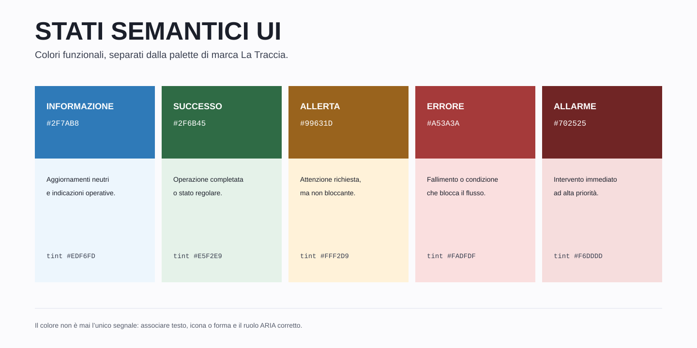

# Colori semantici per le interfacce



Il blu `#4194d7` resta il colore identitario de **La Traccia**. Le interfacce software possono affiancargli colori complementari solo quando il colore comunica uno stato reale del sistema. Non sono una seconda palette di marca e non vanno usati per decorare schermate, brochure, slide o materiale stampato.

## Ruoli

| Stato | Base | Scopo |
|---|---:|---|
| `info` | `#2f7ab8` | Informazione neutra, suggerimento, aggiornamento non problematico |
| `success` | `#2f6b45` | Operazione completata, servizio regolare, verifica superata |
| `warning` | `#99631d` | Attenzione richiesta; rischio o anomalia non ancora bloccante |
| `danger` | `#a53a3a` | Errore, fallimento o condizione che impedisce di proseguire |
| `critical` | `#702525` | Allarme ad alta priorità che richiede intervento immediato |

`info` riusa il blu di marca in una tinta più scura e accessibile. `critical` non introduce un nuovo hue: è una versione più scura della famiglia rossa, riservata agli allarmi veri.

## Famiglie di token

Ogni stato dispone di cinque livelli:

| Suffisso | Uso |
|---|---|
| nessuno | Testo, icona e superficie piena con testo bianco |
| `-dark` | Hover, pressione o enfasi superiore |
| `-tint` | Fondo leggero per messaggi persistenti |
| `-tint-2` | Fondo più evidente |
| `-border` | Filetti, separatori e bordi semantici |

Esempio:

```css
color: var(--tr-state-warning);
background: var(--tr-state-warning-tint);
border-color: var(--tr-state-warning-border);
```

I token CSS sono in [`tokens/tokens.css`](tokens/tokens.css); la versione strutturata è in [`tokens/tokens.json`](tokens/tokens.json).

## Contrasto

I colori base sono stati scelti per raggiungere almeno il rapporto WCAG AA `4.5:1` con il bianco per testo normale su superfici piene.

| Stato | Testo bianco su base |
|---|---:|
| `info` | `4.57:1` |
| `success` | `6.34:1` |
| `warning` | `5.05:1` |
| `danger` | `6.43:1` |
| `critical` | `10.60:1` |

Sui fondi `*-tint` usare normalmente `--tr-ink-900` o `--tr-ink-600`. Il colore semantico resta su icona, titolo e filetto.

## Regole obbligatorie

1. **Il significato non dipende dal solo colore.** Aggiungere sempre una descrizione testuale e, quando utile, un'icona o una forma.
2. **Non scegliere il colore per gusto.** Lo stato determina il colore: un messaggio informativo non diventa rosso per attirare più attenzione.
3. **Distinguere errore e allarme.** `danger` blocca un'operazione; `critical` segnala una condizione operativa urgente.
4. **Limitare le superfici piene.** Il formato normale è il filetto verticale; il fondo tenue serve per messaggi persistenti; il fondo pieno è riservato a errori bloccanti e allarmi.
5. **Non usare questi colori nei materiali editoriali.** Brochure, slide e stampa restano sul blu La Traccia e sui neutri.
6. **Non usare il rosso per azioni innocue.** Un comando rosso distrugge, interrompe o gestisce un pericolo reale.

## Accessibilità e annunci

Per messaggi già presenti nella pagina non serve forzare un annuncio. Per messaggi inseriti dinamicamente:

- `role="status"` per informazioni ed esiti non urgenti;
- `role="alert"` per errori bloccanti;
- `role="alert" aria-live="assertive"` soltanto per un allarme che richiede attenzione immediata.

`aria-live="assertive"` non va usato su avvisi ordinari: interrompe la lettura delle tecnologie assistive.

## Componenti

Caricare l'estensione dopo i file principali:

```html
<link rel="stylesheet" href="tokens/tokens.css">
<link rel="stylesheet" href="css/traccia.css">
<link rel="stylesheet" href="css/traccia-icons.css">
<link rel="stylesheet" href="css/traccia-states.css">
```

Le icone servono davvero: ogni variante porta con sé la propria (`--tr-notice-icon`),
quindi il riquadro `__icon` lasciato vuoto si disegna da solo e il segno d'allarme
non può finire su un messaggio di conferma.

### Avviso strutturato

```html
<div class="tr-notice tr-notice--warning tr-notice--tint" role="status">
  <span class="tr-notice__icon" aria-hidden="true"></span>
  <div class="tr-notice__content">
    <p class="tr-notice__title">Attenzione</p>
    <p class="tr-notice__body">
      La sincronizzazione è in ritardo di 12 minuti.
    </p>
  </div>
</div>
```

### Allarme critico

```html
<div class="tr-notice tr-notice--alarm"
     role="alert"
     aria-live="assertive">
  <span class="tr-notice__icon" aria-hidden="true"></span>
  <div class="tr-notice__content">
    <p class="tr-notice__title">Allarme critico</p>
    <p class="tr-notice__body">
      Servizio non raggiungibile. È richiesto un intervento immediato.
    </p>
  </div>
</div>
```

### Messaggio transitorio

Stesse variabili di variante dell'avviso, tempo diverso: quello resta in pagina,
questo passa. La zona è unica per applicazione e i messaggi si impilano dentro.

```html
<div class="tr-toast-region" role="status" aria-live="polite">
  <div class="tr-toast tr-toast--success">
    <span class="tr-toast__icon" aria-hidden="true"></span>
    <div class="tr-toast__content">
      <p class="tr-toast__title">Salvato</p>
      <p class="tr-toast__body">Revisione 03 archiviata nel fascicolo 2026/0412.</p>
    </div>
  </div>
</div>
```

### Stato compatto

Il testo è parte del componente e non va rimosso:

```html
<span class="tr-status tr-status--success">Operativo</span>
<span class="tr-status tr-status--warning">Degradato</span>
<span class="tr-status tr-status--critical">Allarme</span>
```

La pagina [`examples/stati-ui.html`](examples/stati-ui.html) mostra tutte le varianti.
