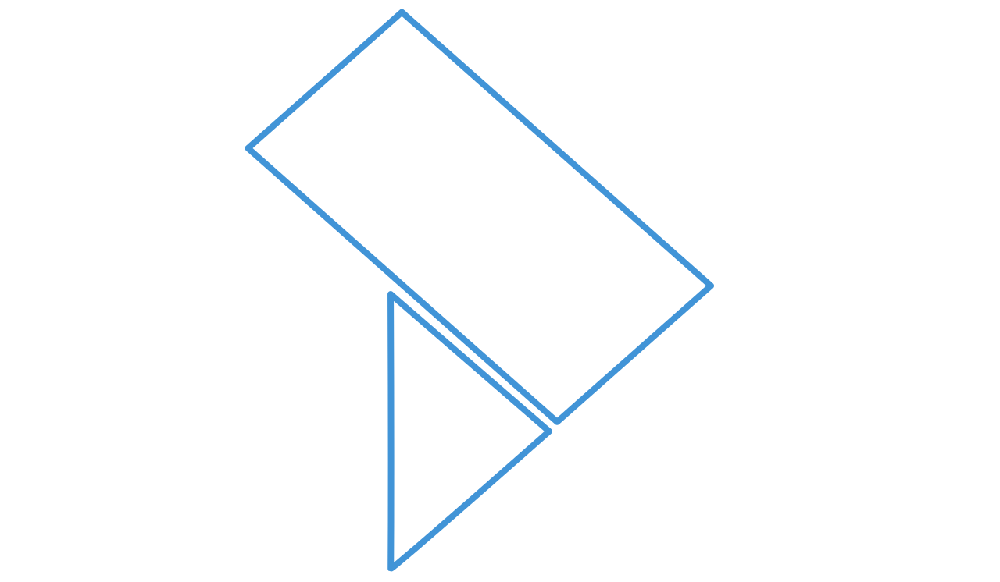

# La Traccia — Design System

Design system aziendale de **La Traccia** (software house — prodotti per PA, sanità e imprese).
Coerente con la brochure **Tmas A100** e il deck istituzionale: grafica minimale basata su linee
sottili e colore, geometrie morbide e smussate, layout aperti senza box. Niente ombre pesanti,
niente gradienti, niente emoji, molto bianco.

## Struttura del repository

```
├── assets/
│   ├── logo-traccia.svg          Logo (chevron blu, pieno)
│   ├── logo-traccia-outline.svg  Sagoma outline per watermark negli sfondi
│   ├── logo-traccia-mark.svg     Solo il marchio, normalizzato: sorgente dello spinner
│   ├── certificazioni.png        Badge certificazioni (IMQ / SI Cert)
│   ├── icons/                    Sorgenti SVG delle icone (stroke currentColor)
│   └── fonts/                    Archivo + IBM Plex Mono, sottoinsieme latino, con OFL
├── tokens/
│   ├── tokens.css                Design token come CSS custom properties
│   └── tokens.json               Design token in formato W3C draft
├── css/
│   ├── traccia-fonts.css         @font-face per i font in locale (prodotti offline)
│   ├── traccia.css               Libreria componenti (prefisso .tr-)
│   ├── traccia-icons.css         Registro icone (mascherature) + .tr-icon
│   ├── traccia-states.css        Stati semantici UI (.tr-notice, .tr-toast, .tr-status)
│   ├── traccia-categories.css    Scala categoriale (solo interfacce software)
│   └── traccia-doc.css           Documenti formali a stampa (prefisso .tr-doc)
├── js/tr-select.js               Listbox del select (vanilla, per Angular e HTML)
├── email/
│   ├── firma-email.html          Firma email (tabelle + stili inline)
│   └── firma-email.txt           Firma email, versione testo semplice
└── index.html                    Documentazione visiva / showcase
```

## Uso rapido

```html
<!-- font: CDN per il web pubblico, oppure css/traccia-fonts.css se il prodotto
     deve reggere senza rete. Vedi "Tipografia · dove stanno i font". -->
<link href="https://fonts.googleapis.com/css2?family=Archivo:wght@400;600;800&family=IBM+Plex+Mono:wght@400;600&display=swap" rel="stylesheet">
<link rel="stylesheet" href="tokens/tokens.css">
<link rel="stylesheet" href="css/traccia.css">
<link rel="stylesheet" href="css/traccia-icons.css">
<link rel="stylesheet" href="css/traccia-states.css">

<body class="tr-page">
  <h1 class="tr-h1">Titolo con parola <em>chiave</em></h1>
</body>
```

## Brand

- **Logo**: chevron/freccia blu (`assets/logo-traccia.svg`). Compare sempre affiancato al wordmark
  **LA TRACCIA** in maiuscolo con letter-spacing 0.08em (componente `.tr-brandmark`).
- **Logo nello sfondo (watermark)**: la sagoma outline del logo
  (`assets/logo-traccia-outline.svg` — stessi tracciati, senza riempimento, tratto blu logo)
  può essere usata negli sfondi delle brochure e delle pagine delle presentazioni:
  opacità 0.16 sul paper, dietro ai contenuti, tipicamente a sbordo da un angolo pagina,
  `pointer-events: none`. Componente `.tr-watermark` dentro un `.tr-watermark-host`
  (position relative + overflow hidden), con varianti di posizione `--top-right` e `--bottom-left`.
- **Tono**: tecnico, sobrio, istituzionale ma moderno.

## Palette

| Token | Hex | Uso |
|---|---|---|
| `brand/500` | `#4194d7` | Blu logo. **Unico accento**: evidenze, numeri, quote, dot, icone |
| `brand/300` | `#8fc0e7` | Linee secondarie |
| `brand/100` | `#d0e4f5` | Tinta pallida decorativa |
| `brand/600` | `#2f7ab8` | Tinta scura, stesso hue: testo piccolo e fondi pieni con testo bianco (4,6:1) |
| `brand/700` | `#266296` | Tinta scura, stesso hue: hover delle superfici piene |
| `surface/tint` | `#eff2f9` | Solo riempimenti piccoli (cerchietti, silhouette). **Non e' un piano**: le card usano `surface` |
| `border/soft` | `#dde2ee` / `#c9cede` | Filetti e bordi leggeri |
| `ink/900` | `#1b1f2a` | Testo primario, tratti dei disegni tecnici |
| `ink/600` | `#3a4050` | Testo secondario / body |
| `ink/400` | `#565c6b` | Didascalie e metadati |
| `paper` | `#fbfbfd` | **Piano 0**: lo sfondo della pagina |
| `surface` | `#ffffff` | **Piano 1**: card e pannelli — vedi [Superfici](#superfici) |
| `state/danger` | `#a53a3a` | **Solo UI software**: errore, campo non valido |
| `state/warning` | `#99631d` | **Solo UI software**: avviso, azione da confermare |
| `state/success` | `#2f6b45` | **Solo UI software**: esito positivo |

**Regola**: mai introdurre altri hue. Per varianti usare oklch mantenendo lo stesso hue del blu logo.
Unica eccezione, e solo nell'interfaccia software: le tre tinte `state/*` per la validazione
dei form e gli esiti di sistema — vedi [Pagine di login](#pagine-di-login-prodotti-software).

## Superfici

**Due piani, non uno.** La **pagina** e' il fondo neutro; i **componenti** che
raccolgono contenuto — card, pannelli — stanno un gradino sopra, in bianco.

| Piano | Token | Cosa ci sta |
|---|---|---|
| 0 · pagina | `paper` `#fbfbfd` | Il fondo su cui si legge |
| 1 · componente | `surface` `#ffffff` | Card, pannelli galleggianti |

E' cosi' che un gruppo si stacca **senza bordo e senza ombra**: lo separa il
piano su cui poggia. E' la stessa idea dei filetti — separare con il minimo —
applicata alla superficie invece che alla linea.

Ne discendono due regole pratiche:

- **Una card non ha bordo.** Se serve un bordo per vederla, vuol dire che non e'
  sul piano giusto.
- **Chi cambia piano lo dichiara ai figli.** La card ridefinisce `--tr-field-bg`
  sul proprio bianco, perche' la tacca dell'etichetta flottante deve ricoprire il
  filetto del campo con il colore della superficie che ha sotto, non con quello
  della pagina. Qualunque contenitore che cambi piano deve fare lo stesso.

Fa eccezione il **pannello del select**, che galleggia sopra il contenuto: li' il
filetto non e' decorazione ma l'unica cosa che ne segna il confine, perche'
bianco su bianco non si staccherebbe.

### Chiaro e scuro

**I valori qui sopra sono quelli della modalita' chiara**, l'unica oggi definita.
Il rapporto fra i piani e' pero' indipendente dal tema: il componente sta sempre
**un gradino piu' vicino alla luce** della pagina che lo ospita. In una modalita'
scura le tinte si invertono — la pagina scende al fondo piu' scuro e i componenti
salgono — e restano validi struttura, filetti e gerarchia. La palette scura non
e' ancora definita: quando servira', va ricavata da questo rapporto, non
scegliendo colori nuovi.

## Tipografia

- **Display/UI — Archivo (400–800)**: titoli in maiuscolo, weight 800, tracking −0.015em,
  line-height 1.04–1.15; la parola chiave finale in blu logo (markup: `<em>` dentro `.tr-h1/.tr-h2`).
- **Tecnico/etichette — IBM Plex Mono (400–600)**: sempre maiuscolo, tracking 0.06–0.3em, per
  eyebrow/kicker, numerazioni, quote, specifiche, contatti, metadati.
- **Body — Archivo 400**: 12–14px stampa / 14–16px UI / 24–30px slide, line-height 1.5–1.65, ink/600.
- **Slide 16:9 (1920×1080)**: mai testo sotto 17px; titoli 60–92px.

### Dove stanno i font

Il CDN non e' l'unica destinazione, ed e' il punto in cui il sistema si era
fermato troppo presto.

```html
<link href="https://fonts.googleapis.com/css2?family=Archivo:wght@400;600;800&family=IBM+Plex+Mono:wght@400;600&display=swap" rel="stylesheet">
```

Quel `<link>` va benissimo per il sito e per tutto cio' che vive in rete. Non va
per un prodotto che gira **offline**, in rete chiusa, o che promette
esplicitamente di non uscire dalla macchina: li' e' una richiesta di rete al
caricamento, e senza connessione i font non arrivano affatto. La pagina ripiega
su `system-ui`, e due prodotti della stessa famiglia finiscono con due
tipografie diverse — che e' esattamente cio' che un design system esiste per
impedire.

I file stanno quindi anche nel repository, e si caricano cosi':

```html
<link rel="stylesheet" href="css/traccia-fonts.css">
<link rel="stylesheet" href="tokens/tokens.css">
```

`traccia-fonts.css` va **prima** dei token e dei componenti, e contiene tre
`@font-face` pronte:

```css
@font-face {
  font-family: "Archivo";
  font-style: normal;
  font-weight: 400 800;          /* variabile: un file copre i tre pesi */
  font-stretch: 100%;
  font-display: swap;
  src: url("../assets/fonts/archivo-latin-var.woff2") format("woff2");
  unicode-range: U+0000-00FF, U+0131, U+0152-0153, U+02BB-02BC, U+02C6, U+02DA,
    U+02DC, U+0304, U+0308, U+0329, U+2000-206F, U+20AC, U+2122, U+2191, U+2193,
    U+2212, U+2215, U+FEFF, U+FFFD;
}
/* + IBM Plex Mono 400 e 600, stessa unicode-range */
```

| Superficie | Font |
|---|---|
| Sito, landing, materiali in rete | CDN |
| Prodotto software installato, rete chiusa, uso offline | `css/traccia-fonts.css` |
| Firma email | nessuno dei due: `Archivo, 'Helvetica Neue', Helvetica, Arial` in linea |

**Il sottoinsieme e' il latino, e basta.** Per l'italiano copre tutto — accenti
e caporali compresi — e tiene i tre file a **63,7 KB** complessivi:

| File | Peso |
|---|---|
| `archivo-latin-var.woff2` | 34,1 KB |
| `ibm-plex-mono-latin-400.woff2` | 14,4 KB |
| `ibm-plex-mono-latin-600.woff2` | 15,3 KB |

Archivo e' variabile: **un file solo copre l'arco 400–800**, quindi i tre pesi
del sistema non costano tre richieste, e `font-weight` si scrive come sempre.
Chi deve comporre in vietnamita o in cirillico scarica da Google Fonts anche
quei sottoinsiemi e aggiunge le `@font-face` con la loro `unicode-range`: il
meccanismo non cambia.

**Licenza.** Entrambi i caratteri sono **SIL Open Font License 1.1**, quindi
ridistribuibili — e' il motivo per cui possono stare qui dentro. Il testo
integrale e' in `assets/fonts/OFL-Archivo.txt` e
`assets/fonts/OFL-IBMPlexMono.txt`, e **va tenuto insieme ai file**, anche nelle
copie del sistema che finiscono dentro un prodotto: la licenza lo richiede, e
costa 9 KB.

`index.html` e le pagine in `examples/` usano la via locale, non il CDN: la
vetrina di un sistema che serve prodotti offline deve reggere senza rete, e
verificarlo e' piu' facile se e' il caso normale.

### Dove finisce il maiuscolo

Il maiuscolo e' una voce, non una decorazione, e ne ha due sole:

1. **La voce mono** — eyebrow, etichette di campo, chip, comandi, tabs, quote,
   contatti. Dice "questo lo scrive il programma": e' un'etichetta che l'occhio
   scorre per orientarsi, non una frase che legge.
2. **I titoli display** `.tr-h1/.tr-h2/.tr-h3`, che aprono una sezione e si
   leggono una volta sola, in grande.

**Fuori di li' si scrive in frase.** Il maiuscolo toglie ascendenti e
discendenti, cioe' la sagoma con cui riconosciamo una parola senza compitarla;
su un'etichetta breve e' un prezzo che si paga volentieri, su un contenuto no.
In particolare il **titolo di una card sta in frase**: e' contenuto — il nome di
un centro, di una misura — spesso e' un nome proprio, e si rilegge decine di
volte al giorno.

## Linguaggio geometrico

- **Layout aperti**: niente box, niente sfondi colorati dietro i contenuti, niente bordi-contenitore.
  La struttura la danno filetti sottili, spaziatura e allineamenti a griglia.
- **Linee stondate** (radius 99px): filetti orizzontali 1–2px `border/soft` (`.tr-rule`);
  segmenti verticali 2px in brand — pieni sopra il contenuto, tinta chiara sotto (`.tr-vseg`).
- **Tratti d'accento** ~64×3px stondati sopra i titoli di sezione (`.tr-accent-dash`),
  al posto di bordi a larghezza piena.
- **A schermo le superfici sono a spigolo vivo**: card, pannelli, campi e azioni non
  hanno raggio. Lo governa un token solo, `--tr-radius-ui`, per poterlo cambiare in un
  punto solo.
- **Pillole** (radius 999px) per chip, dot e cerchietti: la pillola e' una forma a se',
  non un angolo smussato, e resta.
- **Angoli smussati 16–26px** restano dove sono nati, cioe' nella stampa: cornici foto
  e materiali A4.
- **Cerchietti numerati** 24–52px (`.tr-circle`): tinta + cifra mono blu, solo bordo blu
  (`--outline`) o pieno blu (`--solid`).
- **Dot bullet**: pallino pieno blu 6–13px + voce mono (`.tr-dot`, `.tr-dotlist`).
- **Triangoli/chevron** solo come richiamo del logo, con parsimonia.
- **Foto**: render/scontornati PNG fluttuano sul fondo pagina (`.tr-photo-float`,
  object-fit contain); le foto ambientate stanno in cornice arrotondata 22–36px con bordo
  1px `border/soft` e padding 7–14px (`.tr-photo-frame`).

### Nessun valore letterale dove esiste un token

Il commento in cima a `tokens.css` dice che tenere lo spigolo «in un token solo
permette di cambiarlo in un punto solo», e per un po' il sistema si e'
contraddetto da solo: `.tr-notice` e `.tr-tab` scrivevano `border-radius: 0`
come numero, il pallino e i cerchietti scrivevano `50%` invece della pillola, e
quattro componenti scrivevano `#ffffff` a mano. Sono token che avrebbero
smesso di funzionare al primo cambio: chi avesse portato `--tr-radius-ui` a
2px si sarebbe ritrovato due componenti rimasti a zero, senza capire perche'.

La regola non e' pero' «sostituire ogni numero che coincide con un token».
**Un token e' un valore con un significato**, e quando i due non coincidono si
lascia il numero:

| Letterale | Token con lo stesso valore | Si sostituisce? |
|---|---|---|
| `border-radius: 50%` sul dot | `--tr-radius-pill` — «chip, dot e cerchietti» | **Sì**: e' proprio quel ruolo |
| `color: #ffffff` sul cerchietto pieno | `--tr-ink-on-solid` | **Sì**: e' inchiostro su superficie piena |
| `font-size: 13px` su `.tr-step__sub` | `--tr-text-mono` (13px) | **No**: quel testo non e' mono |
| `font-size: 13px` sulla firma del documento | `--tr-doc-text` (13px) | **Sì**: e' il corpo del documento |

Sostituire per coincidenza numerica e' peggio del letterale che si voleva
togliere: lega due cose che non hanno ragione di muoversi insieme, e il giorno
in cui il mono cambia misura si sposta anche un sottotitolo che col mono non
c'entrava niente.

## Icone

Il sistema riservava lo spazio all'icona da prima di averne una. Il campo ha un
prefisso e un suffisso, l'avviso ha un riquadro da 20px, l'azione ha perfino una
regola di movimento sull'icona in coda. Mancava il segno: chi costruiva un
prodotto se lo procurava altrove, e il sistema perdeva il controllo sul disegno
piu' ripetuto dell'interfaccia — quello che l'utente vede cento volte al giorno.

### Griglia e tratto

`viewBox 24`, tratto `2`, estremita' e giunzioni tonde, nessun riempimento.

Il tratto e' la sola misura che conta davvero, e non e' arbitraria: l'icona vive
appaiata all'etichetta di un'azione, che e' Archivo semibold a 13px. Sotto i 2px
il disegno sbiadisce accanto alla parola; sopra, diventa piu' nero della parola
stessa e l'occhio legge prima il simbolo del comando. Le estremita' tonde sono
l'unico punto in cui il sistema smussa un angolo dentro l'interfaccia, ed e'
coerente: `--tr-radius-ui` governa le **superfici**, non i tratti — e i tratti,
dal filetto stondato in poi, sono sempre stati tondi.

### Le tre misure

| Token | Valore | Dove |
|---|---|---|
| `--tr-icon-sm` | 14px | `.tr-btn--sm`, righe di tabella |
| `--tr-icon-md` | 16px | misura corrente: azione, campo, elenco |
| `--tr-icon-lg` | 20px | `.tr-btn--lg`, comando a sola icona, riquadro dell'avviso |

Sono agganciate alle altezze delle azioni che gia' esistevano
(`--tr-btn-h-sm` 32, `--tr-btn-h` 42, `--tr-btn-h-lg` 48), e dentro un pulsante
non vanno dichiarate: e' il pulsante a imporre la misura all'icona.

### La consegna: mascheratura, non markup

Le strade erano due — uno sprite `<symbol>` + `<use>`, oppure un registro di
custom property con `mask-image` e `background: currentColor`. Il sistema ha
scelto la seconda, e la ragione non e' il peso del file (5,8 KB, comunque
trascurabile in entrambi i casi): e' il controllo.

**Se l'icona e' un valore CSS, la variante se la porta dietro.** Un
`.tr-notice--danger` arriva col proprio triangolo perche' la variante imposta
`--tr-notice-icon`, e nessuno puo' accoppiare il segno d'allarme a un messaggio
di conferma. Con uno sprite quel disallineamento resta sempre a un copia-incolla
di distanza, perche' li' il segno lo sceglie chi scrive il markup e il componente
non ha modo di correggerlo. Un sistema che si limita a *sperare* che il markup
sia coerente non sta governando niente.

Il prezzo si paga in `forced-colors: active`, dove il sistema operativo
sostituisce `background-color` e un'icona mascherata sparirebbe. Si ripaga in
fondo a `traccia-icons.css` ridipingendola con un colore di sistema
(`CanvasText`, `ButtonText` dentro le azioni), che non viene sostituito: resta
la forma e si perde il colore semantico — che in quella modalita' non era
comunque un canale disponibile.

Gli stessi disegni stanno in `assets/icons/*.svg` con `stroke="currentColor"`,
per i posti dove il CSS non arriva: la firma email, un allegato, un SVG composto
a mano.

### Uso

```html
<!-- decorativa: accompagna un'etichetta che dice gia' tutto.
     L'etichetta va in un elemento suo, vedi sotto. -->
<button class="tr-btn tr-btn--primary" type="button">
  <span class="tr-icon tr-icon--download" aria-hidden="true"></span>
  <span>Scarica il referto</span>
</button>

<!-- icona in coda: accompagna il gesto e all'hover scivola di 3px -->
<button class="tr-btn tr-btn--secondary" type="button">
  <span>Apri il registro</span>
  <span class="tr-icon tr-icon--arrow-right" aria-hidden="true"></span>
</button>

<!-- unico contenuto del comando: senza aria-label il pulsante non ha nome -->
<button class="tr-btn tr-btn--icon" type="button" aria-label="Elimina la voce">
  <span class="tr-icon tr-icon--trash" aria-hidden="true"></span>
</button>

<!-- dentro un campo: il modificatore riserva lo spazio e sposta l'etichetta -->
<label class="tr-field tr-field--with-prefix">
  <span class="tr-field__prefix"><span class="tr-icon tr-icon--search" aria-hidden="true"></span></span>
  <input class="tr-field__control" id="q" type="search" placeholder="Cerca">
  <span class="tr-field__label">Ricerca</span>
</label>
```

**L'etichetta dell'azione va in un elemento suo.** Il sistema muove l'icona in
coda e tiene ferma quella in testa, ma con l'etichetta scritta come nodo di
testo nudo — `Apri il registro<span class="tr-icon">` — l'icona risulta insieme
primo e **ultimo** figlio, perche' `:first-child` conta gli elementi e non il
testo. La regola non scatta, e non esiste selettore che possa distinguere la
testa dalla coda. Un `<span>` attorno all'etichetta costa una riga e fa
funzionare il sistema; vale anche per le icone scritte come `<svg>`.

**Accessibilita'.** Quando l'icona accompagna un'etichetta e' decorazione e va
`aria-hidden="true"`: annunciarla due volte non aiuta nessuno. Quando e' l'unico
contenuto di un comando, il comando ha bisogno di un `aria-label`, altrimenti
per una tecnologia assistiva quel pulsante non ha nome.

**Il set.** `info`, `alert`, `check`, `close`, `lock`, `unlock`, `download`,
`upload`, `copy`, `file`, `folder`, `save`, `tag`, `sliders`, `search`,
`arrow-right`, `chevron-down`, `external-link`, `trash`, `edit`, `plus`,
`minus`. Sono ventidue perche' sono quelle che un prodotto usa davvero; il
registro si allunga aggiungendo una riga a `:root` e la sua utility, con lo
stesso `viewBox` e lo stesso tratto. Un'icona disegnata su un'altra griglia si
riconosce a colpo d'occhio, ed e' il modo piu' rapido per far sembrare
disordinata un'interfaccia ordinata.

## Componenti

| # | Componente | Classe |
|---|---|---|
| 1 | Header di pagina | `.tr-header` + `.tr-brandmark` |
| 2 | Eyebrow / kicker (con variante nota a destra) | `.tr-eyebrow` |
| 3 | Chip / pill | `.tr-chip` |
| 4 | Voce elenco numerata | `.tr-numbered` |
| 5 | Step di processo (riga da 4, linea `brand/300`) | `.tr-steps.tr-steps--linked` > `.tr-step` |
| 6 | Riga specifiche / elenco tecnico | `.tr-specs`, `.tr-dotlist` |
| 7 | Tabella dati (nota unità in basso a destra) | `.tr-datatable` |
| 8 | Disegno tecnico quotato (convenzioni SVG) | `.tr-drawing` (`.silhouette`, `.quota`, `.quota-label`) |
| 9 | Footer (riga certificazioni solo sulle superfici pubbliche) | `.tr-footer` + `.tr-footer__certs` |
| 10 | Pagina di login (co-branding con il cliente) | `.tr-login` + `.tr-clientmark` |
| 11 | H1/H2 con parola chiave blu | `.tr-h1`, `.tr-h2` + `<em>` |
| 12 | Campo con etichetta flottante | `.tr-field` + `__control` / `__label` |
| 13 | Select con listbox | `.tr-select` + `js/tr-select.js` |
| 14 | Card | `.tr-card` + `__head` / `__title` / `__foot` |
| 15 | Azione | `.tr-btn` + `--primary` / `--secondary` / `--neutral` / `--quiet` / `--danger` |
| 16 | Spinner di caricamento | `.tr-spinner` + `__wipe` / `__track` / `__seq` / `__ring` |
| 17 | Foglio e piede del documento formale | `.tr-doc` + `.tr-doc-footer` — vedi [Documenti formali](#documenti-formali) |
| 18 | Icona | `.tr-icon` + `.tr-icon--<nome>` — vedi [Icone](#icone) |
| 19 | Interruttore | `.tr-switch` (+ `.tr-switch-row`) — vedi [Interruttore](#interruttore) |
| 20 | Messaggio transitorio | `.tr-toast` + `.tr-toast-region` — vedi [Messaggio transitorio](#messaggio-transitorio) |
| 21 | Marcatura di categoria e legenda | `.tr-cat` / `.tr-cat-key` — vedi [Scala categoriale](#scala-categoriale) |

Tutti i componenti sono mostrati e documentati in [`index.html`](index.html).

### Footer e certificazioni

Il footer sta **sempre in fondo alla pagina**, anche quando il contenuto non la
riempie: un footer a mezz'aria sotto una pagina corta sembra un errore di
caricamento, e la riga certificazioni deve chiudere la pagina, non fluttuarci
dentro. Si ottiene con `.tr-shell` sul contenitore e `.tr-shell__body` sul
corpo — il corpo si prende lo spazio che avanza e il footer scende. Vale sia
quando a scorrere e' la pagina, sia quando a scorrere e' un pannello interno.

```html
<main class="tr-shell">
  <div class="tr-shell__body"><!-- contenuto --></div>
  <footer class="tr-footer">…</footer>
</main>
```


La riga certificazioni (`.tr-footer__certs`) e' composta da etichetta
`CERTIFICAZIONI` in mono blu (tracking 0.14em), elenco in mono grigio
`ISO 9001:2015 · ISO 13485:2016 · ISO/IEC 27001:2022 · UNI PdR 125`, filetto stondato
`border/soft` che riempie la riga e badge `assets/certificazioni.png`
(IMQ Certified + SI Cert, altezza ~30px).

**Dove va e dove non va.** Le certificazioni sono una credenziale: servono a chi
non sa ancora con chi ha a che fare. Stanno quindi sulle **superfici pubbliche**
— sito, brochure, pagina di accesso — e si fermano sulla soglia.

**Dentro l'applicazione la riga si omette.** Chi e' entrato l'ha gia' letta, e
ripeterla in calce a ogni schermata non aggiunge fiducia: la consuma. Una
credenziale ripetuta trenta volte al giorno smette di essere letta come una
credenziale e diventa rumore in fondo allo schermo, per giunta nel punto dove
servirebbe silenzio. Dentro resta il footer nudo: firma del fornitore a
sinistra, contatto e riferimento del prodotto a destra.

| Superficie | Riga certificazioni |
|---|---|
| Sito, brochure, slide | Sì |
| Pagina di accesso | Sì — e' ancora la soglia |
| Qualunque schermata dopo l'accesso | **No** |

### Convenzioni disegno tecnico

Silhouette con tratto `ink/900` 2–2.5px e riempimento `surface/tint`, angoli reali del prodotto.
Linee di quota blu 1.5–3px con tacche alle estremità; valore in mono blu con **virgola decimale
italiana** (es. `1.580,0`).

## Pagine di login (prodotti software)

Le pagine di accesso ai prodotti sono l'unico punto in cui il sistema incontra
il marchio di un **cliente**. Valgono le regole generali — layout aperto, niente
card, niente ombre, niente gradienti — piu' le seguenti.

### Co-branding: un solo marchio per lockup

| Posizione | Marchio | Note |
|---|---|---|
| Testata | **Cliente** (`.tr-clientmark`) | La pagina e' il suo prodotto: il suo marchio sta in alto a sinistra, affiancato dal nome del prodotto in mono. |
| Sfondo | La Traccia, sagoma outline (`.tr-watermark`) | Opzionale, opacita' 0,16, a sbordo da un angolo. E' la presenza di marchio "ambientale". |
| Footer | La Traccia (`.tr-footer` + `.tr-brandmark`) | Firma del fornitore. La riga certificazioni solo sulle superfici pubbliche, non dentro l'applicazione. |

**Mai i due marchi affiancati nello stesso lockup**: un logo cliente accanto al
chevron La Traccia produce un blocco confuso e sposta l'identita' della pagina.
La gerarchia e' sempre cliente in testa, La Traccia in calce.

Il logo del cliente **non si ricolora, non si ridisegna e non si mette dentro un
riquadro**: si appoggia sul paper alla sua altezza nominale
(`--tr-client-logo-h`, 40px; 32px sotto i 720px). Se il file del cliente ha un
margine trasparente proprio, va ritagliato prima di essere usato, non compensato
con il padding.

### Struttura

```html
<body class="tr-login tr-watermark-host">
  

  <header class="tr-login__header">
    <div class="tr-header">
      <a class="tr-clientmark" href="/">
        
        <span class="tr-clientmark__sep"></span>
        <span class="tr-clientmark__product">Nome prodotto</span>
      </a>
      <span class="tr-eyebrow__label">Accesso riservato</span>
    </div>
  </header>

  <main class="tr-login__main">
    <div class="tr-login__panel">
      <div class="tr-eyebrow"><span class="tr-eyebrow__label">Accesso</span><span class="tr-eyebrow__line"></span></div>
      <h1 class="tr-h2">Accedi al <em>registro</em></h1>
      <!-- .tr-field / .tr-btn -->
    </div>
  </main>

  <div class="tr-login__footer"><footer class="tr-footer">...</footer></div>
</body>
```

Ogni passo del flusso — credenziali, secondo fattore, configurazione 2FA,
cambio password obbligatorio, recupero credenziali — usa la **stessa
intestazione**: eyebrow mono con filetto, titolo `.tr-h2` con la parola chiave
in blu, testo di servizio in body. Cambia il contenuto, non la struttura.

### Controlli

La pagina di login introduce i tre controlli di interfaccia del sistema, riusabili
ovunque nella UI software:

| Componente | Classe | Nota |
|---|---|---|
| Campo | `.tr-field` + `__control` / `__label` / `__prefix` / `__suffix` / `__assist` | Etichetta flottante, fondo trasparente, filetto 1px che vira al blu sul focus. Vedi sotto. |
| Azione | `.tr-btn` + `--primary` / `--secondary` / `--quiet` / `--block` | Pillola 999px con etichetta mono maiuscola, come la chip. |
| Avviso in linea | `.tr-notice` + `--danger` / `--warning` / `--success` | Filetto verticale colorato: il sistema non ammette pannelli con sfondo colorato dietro ai contenuti. |

### Stati di validazione

`--tr-state-danger` / `--tr-state-warning` / `--tr-state-success` sono l'**unica
eccezione ammessa alla regola del singolo hue**, e valgono solo per
l'interfaccia software: validazione dei form ed esiti di sistema. Sono tinte
desaturate, scelte per convivere con il blu logo senza competere con esso. Su
brochure, slide e materiale stampato non si usano.

### Contrasto

Il blu logo `#4194d7` non regge il testo bianco (2,9:1). Per le superfici piene
con testo bianco e per il testo piccolo in blu si usano le tinte scure dello
stesso hue: `--tr-brand-600` (`#2f7ab8`, 4,6:1 su bianco) e `--tr-brand-700`
per l'hover. `#4194d7` resta per elementi non testuali — dot, filetti, icone —
e per il testo grande in grassetto.

## Campo: etichetta flottante

L'etichetta parte **dentro** il campo, al posto del placeholder, e sale sul filetto
superiore quando il campo riceve il focus o contiene un valore. E' la transizione
che ci si aspetta da un form moderno; qui e' resa nel linguaggio del sistema —
etichetta mono maiuscola, filetto al posto della cornice piena, un solo accento.

### Il comportamento e' in CSS puro

Nessun JavaScript, nessuno stato di componente: **lo stesso markup vale identico in
HTML, React/Next, Angular, Vue, Svelte**. Il meccanismo si regge su tre cose sole:

1. **l'ordine nel DOM**: il controllo viene **prima**, l'etichetta **dopo**
   (il CSS le raggiunge con il combinatore `+`);
2. **`:placeholder-shown`**: il controllo deve quindi avere **sempre** un
   placeholder — se non c'e' niente di utile da mostrare, `placeholder=" "`;
3. **`:focus`**.

Il legame etichetta/controllo resta quello standard (`for` / `id`), quindi
l'ordine invertito non cambia nulla per gli screen reader.

Si animano solo `transform` e `color`: nessun reflow, nessuno sfarfallio, e sotto
`prefers-reduced-motion: reduce` l'etichetta raggiunge lo stesso stato finale
senza corsa.

### Struttura

```html
<div class="tr-field tr-field--with-prefix">
  <input class="tr-field__control" id="email" type="email" placeholder="nome@esempio.it">
  <label class="tr-field__label" for="email">Email <span class="tr-field__required">*</span></label>
  <span class="tr-field__prefix"><!-- icona --></span>
  <div class="tr-field__assist">
    <p class="tr-field__hint">Nota di servizio</p>
  </div>
</div>
```

### Regole

- **Il placeholder resta invisibile** finche' l'etichetta occupa il suo posto:
  compare solo a etichetta salita. Cosi' i due testi non si sovrappongono mai e
  il placeholder puo' tornare a fare il suo mestiere — mostrare un **esempio di
  formato** (`nome@esempio.it`, `1.580,0`), non ripetere l'etichetta.
- **La riga di servizio ha altezza riservata** anche da vuota: la comparsa di un
  errore non deve far saltare il layout del form.
- **Al focus il filetto vira al blu** e raddoppia otticamente con un anello da 1px.
  Non e' un'ombra decorativa: e' l'anello di focus, e serve a non far scattare il
  layout di 1px come farebbe un bordo piu' spesso.
- **La tacca dell'etichetta** salita ricopre il filetto con `--tr-field-bg`, che
  vale `paper`. Se il campo poggia su una superficie diversa, ridefinisci quella
  variabile sul contenitore: `.mia-superficie { --tr-field-bg: #fff; }`.
- **Un solo accento**: il blu segnala il focus, il rosso di stato segnala l'errore.
  Niente altri colori dentro il campo.

### Compilazione automatica del browser

Quando il browser compila un campo da se', il valore si vede ma
`:placeholder-shown` resta valido: nello stato di anteprima di Chrome il valore
e' solo dipinto, non e' ancora nel DOM. Il foglio lo gestisce con `:autofill` e
`:-webkit-autofill`, **ognuno in una regola separata** — un selettore non
riconosciuto invaliderebbe l'intera lista, e con essa il comportamento sugli
altri browser.

Il fondo giallo/azzurro che Chrome dipinge sul campo compilato viene coperto:
e' un pannello pieno dietro al contenuto, e il sistema non lo ammette. Non si
rimuove con `background-color`, serve un'ombra interna piena — motivo per cui
l'anello di focus va ridichiarato insieme a essa.

Niente di tutto questo richiede codice nel componente: vale in ogni framework.

### Controlli senza `:placeholder-shown`

`<select>` e gli input di data/ora mostrano sempre qualcosa e non conoscono
`:placeholder-shown`: il foglio li riconosce da solo e ne tiene l'etichetta
sempre in alto. Nessuna classe da aggiungere.

Per i **widget che un framework rende con un componente proprio** — autocomplete,
`ng-select`, `react-select`, date picker custom — non esiste un `<input>` da
interrogare: in quel caso il componente aggiunge `tr-field--float` al contenitore
quando ha un valore. E' l'unico punto in cui serve una riga di codice, ed e'
la stessa in ogni framework.

### Uso per framework

Il markup e' identico ovunque; cambia solo la sintassi degli attributi.

**HTML / Vue / Svelte**

```html
<div class="tr-field">
  <input class="tr-field__control" id="nome" placeholder=" ">
  <label class="tr-field__label" for="nome">Nome</label>
</div>
```

**React / Next**

```jsx
<div className={`tr-field ${error ? 'tr-field--error' : ''}`}>
  <input className="tr-field__control" id="nome" placeholder=" "
         value={value} onChange={(e) => setValue(e.target.value)} />
  <label className="tr-field__label" htmlFor="nome">Nome</label>
  <div className="tr-field__assist">
    {error ? <p className="tr-field__error">{error}</p> : <p className="tr-field__hint">{hint}</p>}
  </div>
</div>
```

**Angular** (reactive forms)

```html
<div class="tr-field" [class.tr-field--error]="nome.invalid && nome.touched">
  <input class="tr-field__control" id="nome" placeholder=" " [formControl]="nome">
  <label class="tr-field__label" for="nome">Nome</label>
  <div class="tr-field__assist">
    <p class="tr-field__error" *ngIf="nome.invalid && nome.touched">Campo obbligatorio</p>
    <p class="tr-field__hint" *ngIf="nome.valid || !nome.touched">Nota di servizio</p>
  </div>
</div>
```

Nota per Angular: se incapsuli il campo in un componente, ricorda che
l'incapsulamento di stile predefinito (`Emulated`) riscrive i selettori del
componente ma **non** tocca `traccia.css` caricato globalmente — vanno quindi
importati `tokens.css` e `traccia.css` a livello di applicazione
(`angular.json` → `styles`), non dentro il singolo componente.

### Stati e modificatori

| Classe | Su | Effetto |
|---|---|---|
| `.tr-field--with-prefix` / `--with-suffix` | contenitore | Riserva lo spazio per l'icona e sposta l'etichetta di conseguenza |
| `.tr-field--error` | contenitore | Filetto, etichetta, prefisso e messaggio in `state/danger` |
| `.tr-field--float` | contenitore | Forza l'etichetta in alto (widget di framework) |
| `.tr-field__control--code` | controllo | Cifre mono distanziate e centrate, per OTP |
| `.tr-field__suffix--action` | suffisso | Rende il suffisso cliccabile (mostra password, cancella, apri calendario) |

### Gruppo di opzioni

Radio e checkbox non hanno un controllo unico su cui far salire l'etichetta: il
gruppo tiene la sua etichetta sopra, statica, nello stesso stile mono del campo.
Va reso con `<fieldset class="tr-fieldset">` e `<legend class="tr-fieldset__legend">` —
non per stile, ma perche' e' il markup che lega le opzioni fra loro per le
tecnologie assistive. In errore si usa `.tr-fieldset--error` sul contenitore.
| `disabled` / `readonly` | controllo | Gestiti dagli attributi nativi, nessuna classe |


## Card

Prima di mettere una card, chiedersi se bastano un filetto e un po' di spazio: il
sistema preferisce i layout aperti, e la maggior parte di cio' che viene chiamato
"card" e' in realta' una sezione di pagina. La card serve dove un gruppo di
contenuti e' davvero **un'unita'** — una scheda, un pannello, un riepilogo.

Quando serve, **non ha ne' bordo ne' ombra**: la separa il piano su cui poggia —
la pagina e' neutra, la card e' bianca. Vedi [Superfici](#superfici).

| Cosa non ha | Perche' |
|---|---|
| Bordo | Se serve un bordo per vederla, non e' sul piano giusto |
| Ombra | Il sistema non ha profondita' da simulare |
| Raggio | Le superfici dell'interfaccia sono a spigolo vivo |

### Parti

`__head` (con `--bare` per toglierne il filetto), `__title` — Archivo **in
frase**, con la parola chiave in blu tramite `<em>` come i titoli di sezione;
il maiuscolo qui apparterrebbe alla voce sbagliata, [vedi sopra](#dove-finisce-il-maiuscolo) — `__sub`,
`__aside` per il metadato in coda, `__foot` per le azioni, `__empty` per lo stato
vuoto: mono, centrato, senza illustrazioni.

`.tr-card-grid` dispone piu' card con una spaziatura coerente, senza margini sui
singoli elementi.

### Varianti

`--plain` riporta la card sul piano della pagina, togliendole la superficie: e'
la scelta giusta per i blocchi impilati, dove a dividere bastano lo spazio e i
filetti che il contenuto ha gia'.

`--action` rende la card cliccabile. Non avendo bordo da tingere, il richiamo e'
lo stesso delle azioni: **un filetto che cresce da sinistra** lungo il bordo
inferiore, e il titolo si scurisce. Nessun sollevamento — un'ombra che cresce
simulerebbe una profondita' che il sistema non ha.

#### Card scelta

In una fila di card che si escludono a vicenda, una dev'essere riconoscibile
come la scelta corrente. **Non si tinge il fondo e non si accende un bordo**: la
card non ne ha, e una classe come `border-brand-500` su una superficie con
`border: 0` non dipinge niente — e' l'errore piu' facile da commettere qui,
perche' il codice sembra giusto.

La scelta prende **il fianco sinistro**: filetto pieno da 3px in `brand/500`,
titolo in `brand/700`. Il bordo inferiore e' gia' impegnato dall'hover, e i due
segni non possono stare sullo stesso lato — uno coprirebbe l'altro, e a
distinguerli resterebbe una sfumatura di blu. Cosi' invece si leggono per
posizione: **sotto** vuol dire "ci sei sopra col mouse", **a sinistra** vuol
dire "e' questa".

E' lo stesso gesto dell'avviso in linea, ed e' l'unico segno presente a riposo:
in una fila di quattro card la scelta si trova subito, senza confrontarle.

```html
<button class="tr-card tr-card--action" aria-pressed="true">…</button>
<a class="tr-card tr-card--action" aria-current="true">…</a>
<div class="tr-card tr-card--action is-selected">…</div>
```

Si dichiara con `aria-pressed` su un `<button>`, `aria-current` su un `<a>`, o
`.is-selected` dove non c'e' semantica da esprimere. Anche qui lo stato passa
dall'attributo e non da una classe di comodo: **niente pallino, niente spunta
appesa a destra** — un segno staccato dal contenuto si legge come decorazione,
non come stato.

### Gruppi di opzioni: non usare `<fieldset>`/`<legend>`

Il gruppo di radio o checkbox va reso con `<div role="group">` e un'etichetta
collegata da `aria-labelledby`. Il legame per le tecnologie assistive e' lo
stesso di `<fieldset>`/`<legend>`, ma `<legend>` ha regole di rendering tutte sue
dentro un `<fieldset>` e non si comporta come un normale blocco: qualunque
tentativo di dargli un margine affidabile ne rompe il flusso, e dentro una
griglia le opzioni finiscono per scavalcare la colonna accanto.

## Azioni

**Nessuno sfondo, nessuna cornice**: solo l'etichetta mono maiuscola e un
filetto. E' la stessa regola del resto del sistema — la struttura la danno i
filetti, la spaziatura e gli allineamenti, non le scatole — applicata finalmente
anche alle azioni, che erano rimaste l'ultimo elemento con un contenitore pieno.

A riposo il pulsante e' **solo la sua etichetta**: il filetto compare sotto il
puntatore. La gerarchia si legge quindi da una cosa sola, **il colore
dell'inchiostro** — ed e' il motivo per cui le varianti sono cinque e non di
piu': senza fondo, senza cornice e senza filetto fisso non ci sono altri gradi
da esprimere, e inventarne renderebbe solo indistinguibili due nomi.

Va detto: senza fondo e senza bordo l'azione somiglia a un collegamento. E' un
compromesso voluto in favore della quiete della pagina, e regge finche' le
etichette restano in mono maiuscolo, che nel sistema significa "comando". Dove
un'azione deve farsi trovare a colpo d'occhio in mezzo a molto testo, il posto
giusto e' in cima al blocco o in fondo a un gruppo, non annegata nel mezzo.

### Gerarchia

| Variante | Quando |
|---|---|
| `--primary` | Inchiostro blu. **Una sola per schermata** |
| `--secondary` | Inchiostro scuro |
| `--neutral` | Inchiostro tenue: annulla, chiudi, torna indietro |
| `--quiet` | Inchiostro tenue, filetto blu: azioni di servizio |
| `--danger` | Inchiostro rosso: solo cio' che distrugge |

### Contrasto

**O testo bianco su superficie piena, o inchiostro scuro su carta.** Mai un
fondo a tinta pallida con testo dello stesso hue — azzurrino con blu scuro,
arancio chiaro con arancio scuro: e' il contrasto piu' debole che si possa
scegliere, e a schermo si legge male. 
Due scelte che vale la pena motivare:

**`--neutral` non e' `--secondary`.** Annulla non e' un'azione secondaria del
compito, e' il modo di uscirne: darle il blu significa richiamare l'occhio su
un'uscita. Filetto e inchiostro, niente accento.

**Il rosso e' riservato a cio' che distrugge.** Un pulsante rosso che non
cancella nulla svaluta quelli che lo fanno davvero, e quando conta l'utente non
si ferma piu'.

### Hover

All'hover **cresce un filetto da sinistra sotto l'etichetta**. E' l'unica cosa
che si muove, ed e' anche l'unica cosa che compare: a riposo non c'e' nulla
sotto il testo. Solo un `transform`, quindi nessun reflow e il testo resta fermo.

La neutra fa eccezione e usa l'inchiostro invece dell'accento: e' un'uscita, non
un'azione da richiamare. Il pulsante a sola icona non ha filetto — una
sottolineatura sotto un simbolo non si legge come tale — e cambia inchiostro.

L'icona **in coda** accompagna il gesto spostandosi di 3px; quella in testa resta
ferma, altrimenti scivolerebbe addosso al testo. Alla pressione il pulsante cede
di un pixel: e' il solo riscontro tattile che il sistema si concede, non avendo
ombre da schiacciare.

Sotto `prefers-reduced-motion: reduce` lo stato finale resta, la corsa no. E su
touch l'hover non esiste: il pulsante deve reggersi gia' da fermo.

### L'unica eccezione: la pagina di login

Ovunque l'azione e' senza fondo, e regge perche' attorno c'e' del contenuto che
le da' contesto. Nella pagina di login non c'e': una schermata quasi vuota, un
campo, un solo comando. Li' un'etichetta senza superficie si legge come un
collegamento invece che come il pulsante che chiude il compito — e su un accesso
non ci si puo' permettere l'esitazione.

Dentro `.tr-login`, e solo li', `--primary` torna a essere una superficie piena.
**Non e' una variante**: e' una regola legata al blocco della pagina di login,
proprio perche' non possa essere usata altrove per comodita'. Lo spigolo vivo
resta — cambia il fondo, non la geometria.

### Tipografia dell'etichetta

L'etichetta e' in mono maiuscolo, che nel sistema significa "comando". Ma il
mono maiuscolo si legge bene solo se non lo si tratta come un'etichetta da
scorrere:

| | Valore | Perche' |
|---|---|---|
| Corpo | 13px (`--sm` 12px, `--lg` 14px) | Sotto i 12px il mono perde tratto: le aste si assottigliano e il maiuscolo, che non ha ascendenti ne' discendenti, non ha piu' niente con cui compensare |
| Tracking | `--tr-tracking-mono-ui` (0.03em) | **Non** `--tr-tracking-mono` (0.08em) |
| Peso | semibold | Il regular a queste misure e' troppo esile su fondo chiaro |

Il tracking e' il punto che sbaglia piu' spesso. Il mono ha gia' le sue
spaziature laterali generose — sono nel disegno del carattere, perche' ogni
lettera occupa la stessa cassa. Aggiungerci gli 0.08em pensati per l'eyebrow
stacca le lettere l'una dall'altra e disfa la parola: `ESPORTA TUTTO IN PDF`
smette di essere quattro parole e diventa venti segni in fila. Su un'etichetta
che l'occhio attraversa e' un pregio; su una parola che si legge e si clicca e'
un difetto.

Vale allo stesso modo per le [tabs](#tabs): stessa lingua, stessa cura.

### Misure e stati

`--sm` (32px) per barre, tabelle e azioni di riga; misura standard 42px; `--lg`
(48px). `--block` occupa la riga, `--icon` rende l'area cliccabile quadrata — e li' **`aria-label` e' obbligatorio**,
altrimenti il pulsante e' muto per chi non vede l'icona.

Durante un'azione in corso si usa `aria-busy="true"`: il pulsante resta
leggibile ma non ricliccabile. Cambia il testo, non la scatola, cosi' la riga
non salta mentre si attende.

`.tr-btn-group` tiene insieme piu' azioni con una spaziatura coerente. Senza
scatole serve piu' aria fra un comando e l'altro — 32px — altrimenti due
etichette vicine si leggono come una sola riga di testo.

## Select

Il menu di un `<select>` nativo lo disegna il sistema operativo: non e' stilabile,
in nessun browser. Dove serve il linguaggio del sistema anche dentro al menu, il
select viene affiancato da una listbox costruita a parte (`.tr-select`).

**Il `<select>` nativo pero' resta nel DOM ed e' lui a tenere il valore.** Si
aggiorna e riemette `input` e `change`, quindi form nativi, reactive forms di
Angular, `ngModel` e qualunque codice in ascolto continuano a funzionare senza
sapere nulla di questo componente. Ed e' anche il ripiego: finche' la classe
`.tr-select--ready` non c'e' — script non caricato, errore, markup parziale —
resta in campo il select nativo, funzionante. Non e' una sostituzione, e' un
miglioramento progressivo.

### Il comportamento delle voci

La voce puntata dal mouse mostra un dot blu che entra da sinistra mentre
l'etichetta scorre a destra. **Si muovono solo `opacity` e `transform`**: la riga
non cambia dimensione e non si sposta, quindi il puntatore non "perde" la voce
che stava mirando. E' il motivo per cui l'indentazione non si fa con `padding` o
`width`, che sono la scelta istintiva ma fanno saltare la riga sotto il cursore.

La voce attiva da tastiera usa lo stesso stato della voce puntata dal mouse
(`.tr-select__option--active`), cosi' le due navigazioni si somigliano invece di
comportarsi in modo diverso. La voce scelta tiene dot ed etichetta indentata in
modo permanente, in semibold.

### Ricerca nelle liste lunghe

Su un elenco lungo scorrere non basta, e la digitazione del select nativo cerca
solo **dall'inizio** della voce: chi ha in testa "Cardarelli" non trova
"Campania — Napoli, Cardarelli". Oltre le **10 voci** il pannello mostra quindi
un campo di ricerca che filtra su tutta l'etichetta. Sotto la soglia non compare:
su cinque voci sarebbe solo un ostacolo in piu'.

Si forza o si esclude con `data-tr-select-search="true|false"` sul campo
(`searchable` nella versione React).

- **Confronto tollerante**: senza maiuscole e senza accenti. "elia" trova
  "Sant'Elìa", "citta" trova "Citta'".
- **Il fuoco entra nel campo**: si apre e si digita, senza un secondo gesto.
  Frecce, `Home`/`End` e `Invio` continuano a valere mentre si scrive, quindi
  non serve uscire dal campo per scegliere.
- **Conteggio** delle voci rimaste, in mono, con `aria-live="polite"`.
- **Nessun risultato** ha una riga dedicata, non un pannello vuoto.
- Le voci escluse ricevono l'attributo `hidden`: restano nel DOM ma fuori
  dall'albero di accessibilita', cosi' uno screen reader legge solo cio' che si
  vede. Attenzione: `.tr-select__option` ha un `display` esplicito, che batte la
  regola `[hidden]` del browser — il foglio la ridichiara apposta.

Con la ricerca **il combobox e' il campo di testo**, non piu' il trigger: due
elementi che dichiarano lo stesso ruolo confonderebbero gli screen reader. Il
trigger resta un bottone con `aria-haspopup="listbox"`, e
`aria-activedescendant` passa al campo.

### Variante compatta

I filtri che vivono dentro una barra non sono campi di form: non hanno attorno
lo spazio di un'etichetta flottante ne' di una riga di servizio, e un campo da
56px li sfonda. `.tr-field--compact` (con `.tr-select--compact` per il select)
abbassa il campo a 40px, toglie l'etichetta interna e la riga di servizio.

L'etichetta **resta comunque nel markup**: o scritta di fianco al campo, o resa
con `.tr-sr-only` per le sole tecnologie assistive. Un filtro senza etichetta e'
muto per chi non lo vede.

Attenzione a non annidarla in un contenitore gia' bordato: il campo porta il
proprio filetto e i due bordi si sommano.

### Gruppi di opzioni

`<optgroup>` nel select nativo, `group` sulla voce nella versione React. Le voci
dello stesso gruppo vanno tenute contigue. Il gruppo e' reso con un
`<ul role="group">` annidato — e' cosi' che ARIA ammette di raggruppare dentro
una listbox — e l'intestazione e' un'etichetta tecnica, quindi mono maiuscola.

Serve quando la stessa etichetta ricorre con significati diversi: "Medico" sotto
"Registro Biopsie" e "Medico" sotto "Registro Dialisi" sono due ruoli distinti, e
senza l'intestazione del gruppo diventano indistinguibili.

### Struttura

```html
<div class="tr-field tr-select tr-field--with-suffix" data-open="false">
  <select class="tr-field__control tr-select__native" id="coorte">…</select>
  <button class="tr-field__control tr-select__trigger" role="combobox"
          aria-haspopup="listbox" aria-expanded="false" aria-controls="coorte-listbox">
    <span class="tr-select__value">Prevalenti</span>
  </button>
  <label class="tr-field__label" for="coorte-trigger">Coorte</label>
  <span class="tr-field__suffix tr-select__chevron" aria-hidden="true"><!-- chevron --></span>
  <div class="tr-select__panel">
    <div class="tr-select__search"><!-- solo oltre le 10 voci --></div>
    <ul class="tr-select__list" id="coorte-listbox" role="listbox">
      <li class="tr-select__option" role="option" aria-selected="true">
      <span class="tr-select__dot"></span>
      <span class="tr-select__option-label">Prevalenti</span>
    </li>
    </ul>
  </div>
  <div class="tr-field__assist"></div>
</div>
```

`.tr-select` sta **sul contenitore del campo**, non su un elemento interno: e'
da li' che l'etichetta flottante e lo stato di errore raggiungono il trigger.

### Uso per framework

**HTML semplice, Angular, Vue, Svelte** — l'enhancer costruisce trigger e
pannello a partire dal solo `<select>`:

```html
<div class="tr-field tr-select tr-field--with-suffix">
  <select class="tr-field__control" id="coorte" [formControl]="coorte">
    <option value="" disabled selected>Seleziona una coorte</option>
    <option value="prev">Prevalenti</option>
  </select>
  <label class="tr-field__label" for="coorte">Coorte</label>
  <div class="tr-field__assist"></div>
</div>

<script src="js/tr-select.js"></script>
<script>TrSelect.enhanceAll();</script>
```

In Angular va chiamato in `ngAfterViewInit` sul sottoalbero del componente
(`TrSelect.enhanceAll(this.host.nativeElement)`), e `destroy()` in `ngOnDestroy`.
Dopo aver cambiato le `<option>` a runtime serve `sync()`.

**React / Next** — l'enhancer **non** va usato: la scrittura diretta su `.value`
non attraversa il value tracker di React e un componente controllato non se ne
accorgerebbe. La' si scrive un componente che rende le stesse classi e gli stessi
attributi ARIA, con lo stato tenuto da React. Il contratto condiviso e' il
markup, non il file JS.

Attenzione, in React, al `<select>` nascosto: se il valore corrente e' la stringa
vuota e fra le `<option>` non ce n'e' una di valore vuoto, il browser ripiega
sulla prima voce e il nativo finisce per dire una cosa diversa dallo stato del
componente — con il risultato che un invio nativo del form manderebbe un valore
che l'utente non ha mai scelto.

### Tastiera

| Tasto | Effetto |
|---|---|
| `↓` / `↑` | Apre il pannello; a pannello aperto sposta la voce attiva, saltando le disabilitate |
| `Home` / `End` | Prima / ultima voce selezionabile |
| `Invio` / `Spazio` | Apre, oppure conferma la voce attiva |
| `Esc` | Chiude senza scegliere |
| `Tab` | Chiude e prosegue |
| lettere | Salta alla voce che inizia cosi', come nel select nativo |

### Dettagli

- **Apertura verso l'alto**: se sotto il trigger non c'e' spazio, il pannello si
  apre in su (`data-drop="up"`). Deciso all'apertura, sulla posizione reale.
- **Segnaposto**: una `<option>` disabilitata di valore vuoto resta visibile nel
  pannello, come nel select nativo, ma senza dot ne' indentazione — non e' una
  scelta. All'apertura la voce attiva parte dalla prima realmente selezionabile.
- **Liste lunghe**: il pannello scorre (max 268px) e la voce attiva resta in vista.
- **Nessun listener globale permanente**: quelli sul documento esistono solo
  mentre un pannello e' aperto e vengono rimossi alla chiusura.


## Tabs

Cambiare vista non e' navigare. Le tabs restano dentro la pagina e non
pretendono la voce alta di un menu: sono etichette mono in fila, e a dire quale
sia quella attiva e' **un filetto** — lo stesso gesto dei pulsanti, dove pero'
li' compare all'hover e qui resta acceso su quella scelta.

```html
<div class="tr-tabs" role="tablist">
  <button class="tr-tab" role="tab" aria-selected="true"  aria-controls="p1" id="t1">Inserimento</button>
  <button class="tr-tab" role="tab" aria-selected="false" aria-controls="p2" id="t2">
    Storico <span class="tr-tab__count">3</span>
  </button>
</div>
<div role="tabpanel" id="p1" aria-labelledby="t1">…</div>
```

### Le tre condizioni

| Stato | Etichetta | Filetto |
|---|---|---|
| A riposo | `ink/400` | spento |
| Sotto il puntatore | `ink/900` | pieno, `border/soft-2` |
| Attiva | `ink/900` | pieno, `brand/500` |

Il filetto cresce da sinistra in 180ms, come quello dei pulsanti: e' la stessa
grammatica, e chi ha gia' imparato a leggere l'una legge anche l'altra.

### Regole

- **Niente pastiglia, niente fondo colorato, niente slab scura.** Una tab attiva
  disegnata come un blocco pieno diventa un pulsante premuto, e la fila smette
  di leggersi come una fila. Il segno e' il filetto e basta.
- **La barra sta sul piano dei componenti** (`surface`) e si stacca dal
  contenuto con un filetto soltanto — mai con un'ombra, mai invertendo i colori.
- **`--bottom` per la barra ancorata in fondo.** Il filetto passa sopra la tab
  invece che sotto, cosi' punta al contenuto e non al vuoto sottostante.
- **Il conteggio e' un dato**, non una decorazione: cifre tabellari in coda
  all'etichetta con `.tr-tab__count`, senza pastiglia intorno. Sulla tab attiva
  passa a `brand/600`.
- **Su schermo stretto la fila scorre**, non va a capo: una tab tagliata a meta'
  dal bordo dice che ce n'e' dell'altra, due righe di tabs non dicono niente.
- L'icona in testa e' ammessa a 15px; quella in coda no, perche' li' il filetto
  ha gia' il compito di chiudere l'etichetta.

### Accessibilita'

`role="tablist"` sul contenitore, `role="tab"` e `aria-selected` su ciascuna,
`aria-controls` verso il pannello e `aria-labelledby` di ritorno. Lo stato
attivo non si trasmette con una classe ma con `aria-selected="true"`: il CSS
legge quello, quindi markup accessibile e aspetto giusto non possono divergere.


## Interruttore

`.tr-switch` — un'opzione a due stati che **ha effetto subito**: la cifratura si
accende, il filtro si applica, il salvataggio automatico parte.

Il riflesso, quando serve un interruttore, e' di prendere la pillola con la
pallina che scivola. Ma quella forma appartiene a un altro sistema: qui
`--tr-radius-ui` vale `0` e non ci sono ombre, e una pillola in mezzo a campi e
pulsanti a spigolo vivo si legge come un pezzo importato. Pista e cursore
restano quindi rettangolari, il filetto e' quello di sempre, e il segno di stato
lo danno il riempimento pieno e la posizione.

### La posizione prima del colore

Il cursore compie una corsa pari a `w - h`, cioe' esattamente meta' pista. Non e'
un vezzo: e' la ragione per cui lo stato resta leggibile **senza colore**. Con
una corsa breve, spento e acceso si distinguono solo perche' uno e' blu; con
mezza pista si distinguono anche in una fotocopia, e in `forced-colors: active`
— dove il file degli stati aveva gia' aperto la strada — il componente si
appoggia proprio a quello.

Il cursore non ha un token proprio: si ricava dall'altezza della pista
(`h − 2 filetti − 2 respiri`), cosi' cambiare `--tr-switch-h` non lo puo'
sfasare. Da li' discende anche la corsa, che vale `w − h` e basta.

### Markup

```html
<div class="tr-switch-row">
  <button class="tr-switch" type="button" role="switch"
          aria-checked="true" aria-labelledby="sw-cifratura"></button>
  <span class="tr-switch-row__label" id="sw-cifratura">Cifratura del pacchetto</span>
  <span class="tr-status tr-status--success" aria-hidden="true">Attiva</span>
</div>
```

`<button role="switch" aria-checked>`, non una checkbox travestita: il ruolo lo
dichiara l'elemento, e lo stato lo scrive l'applicazione che ospita il
componente cambiando `aria-checked`. Il nome accessibile arriva da
`aria-labelledby` — un `<label for>` puntato a un `<button>` non lega nulla.

**La parola di stato accanto e' `.tr-status`, non una pill colorata.** Pallino
piu' testo reggono anche a colori spenti; una pill colorata, no. Per le
tecnologie assistive quella parola e' ridondante, perche' `aria-checked` lo dice
gia': va quindi `aria-hidden="true"`, altrimenti lo stato viene annunciato due
volte.

Focus con `outline: 2px solid var(--tr-brand-500)` e `outline-offset: 2px`, lo
stesso di `.tr-btn`. Disabilitato con l'attributo `disabled`: opacita' 0,45, e la
posizione del cursore resta comunque leggibile.

### Quando invece non usarlo

L'interruttore **promette che l'effetto sia gia' avvenuto**. Se la scelta va
confermata — se in fondo alla pagina c'e' un *Salva* — l'interruttore mente, e
l'utente crede di aver cambiato qualcosa che invece non e' cambiato. Li' servono
due `.tr-tab`, o un gruppo di opzioni dentro un `.tr-fieldset`: dichiarano di
essere una scelta in attesa, e c'e' ancora un comando che chiude il compito.

| Serve | Componente |
|---|---|
| Opzione con effetto immediato | `.tr-switch` |
| Scelta fra due viste dello stesso contenuto | `.tr-tab` |
| Scelta da confermare con un comando | gruppo di opzioni in `.tr-fieldset` |

## Messaggio transitorio

`.tr-toast` — la conferma che passa: *copiato*, *salvato*, *porta occupata*.
`.tr-notice` copriva gia' il messaggio che resta in pagina; mancava il tempo
breve, ed e' una necessita' universale in un prodotto software. Finche' non
c'era, ognuno se la inventava.

### Non e' una famiglia nuova

Le variabili di variante — `--tr-notice-accent`, `--tr-notice-border`,
`--tr-notice-icon` e le altre — sono dichiarate **una volta sola** in testa a
`traccia-states.css`, su un selettore che nomina insieme `.tr-notice` e
`.tr-toast`. Non e' un dettaglio di implementazione: e' l'unico modo perche' i
due componenti non divergano. Con due famiglie parallele, il primo che ritocca
il giallo dell'allerta lo ritocca in un posto solo, e sei mesi dopo l'avviso in
pagina e la conferma che passa hanno due gialli diversi.

Dalla stessa variante arriva anche l'icona, quindi il riquadro `__icon` si
lascia vuoto e si disegna da solo — vedi [Icone](#icone).

### La superficie scura e' un'eccezione, e si paga

Il sistema non ammette pannelli con fondo colorato dietro ai contenuti, e
l'avviso in linea infatti non ne ha: gli basta un filetto sul fianco, perche'
sta **dentro** il flusso, e il flusso gli fa da contesto. Il messaggio
transitorio no: arriva non richiesto sopra il contenuto, e senza un piano
proprio il testo si mescolerebbe a quello che c'e' sotto. Una conferma
illeggibile non conferma niente.

Il fondo e' quindi `ink/900` pieno, e il filetto d'accento prende il **gradino
chiaro** della stessa famiglia (`--tr-notice-border`) invece della tinta piena:
su fondo scuro `danger` o `success` non si staccherebbero. Non e' una variabile
parallela — e' un altro passo della stessa scala.

### Markup

```html
<!-- una sola zona per applicazione: i messaggi si impilano dentro -->
<div class="tr-toast-region" role="status" aria-live="polite">
  <div class="tr-toast tr-toast--success">
    <span class="tr-toast__icon" aria-hidden="true"></span>
    <div class="tr-toast__content">
      <p class="tr-toast__title">Salvato</p>
      <p class="tr-toast__body">Revisione 03 archiviata nel fascicolo 2026/0412.</p>
    </div>
    <button class="tr-btn tr-btn--icon tr-btn--sm" type="button" aria-label="Chiudi il messaggio">
      <span class="tr-icon tr-icon--close" aria-hidden="true"></span>
    </button>
  </div>
</div>
```

### Annunci e durata

| Cosa | Ruolo | Chiusura |
|---|---|---|
| Conferma (`success`, `info`, neutro) | `role="status"` + `aria-live="polite"` sulla zona | automatica |
| Errore o allerta che interrompe il compito | `role="alert"` sul singolo messaggio | **solo a mano** |

`polite` aspetta che la tecnologia assistiva finisca la frase in corso; e' cio'
che serve a una conferma, che non ha fretta. `alert` interrompe, ed e' corretto
solo quando il compito si e' fermato davvero.

**Durata minima: 4 secondi**, piu' un secondo ogni cinque parole oltre le dieci.
E' il tempo di accorgersi che qualcosa e' comparso, spostare lo sguardo e
leggere. Un messaggio che sparisce prima ha fatto solo rumore.

**Un errore non si chiude da solo.** Un errore che sparisce prima di essere
letto e' un errore nascosto, e l'utente resta convinto che l'operazione sia
riuscita. Se il messaggio porta un comando — *Riprova*, *Annulla* — il timer non
parte affatto: nessuno insegue un pulsante che scappa.

**Il conto si ferma sotto il puntatore e col focus dentro**, e riparte quando
si esce: e' l'unico modo perche' chi sta leggendo o sta per premere *Annulla*
non si veda portare via il messaggio a meta'.

L'entrata e' una traslazione di 8px in 180ms, spenta sotto
`prefers-reduced-motion: reduce` — li' il messaggio compare, non entra.

## Spinner di caricamento

L'attesa non ha bisogno di una forma nuova. Le quattro varianti muovono tutte
il **chevron del marchio**: nessuna forma nuova, nessun secondo colore, nessuna
ombra e nessun gradiente. Si animano soltanto `opacity` e `transform`, quindi
l'attesa non fa reflow e non sposta niente attorno a se'.

A scegliere la variante e' la **durata dell'attesa**, non il gusto.

| Variante | Classe portante | Quando |
|---|---|---|
| Riempimento | `.tr-spinner__wipe` | schermo intero, attesa oltre il secondo |
| Traccia | `.tr-spinner__track` | caricamento di una pagina o di un elenco |
| Sequenza | `.tr-spinner__seq` | attesa breve accanto a un'azione o dentro un pulsante |
| Anello | `.tr-spinner__ring` | attesa indeterminata al centro di un pannello |

### Il simbolo, una volta per pagina

Il marchio non compare mai con un contorno proprio: le varianti riusano i
tracciati di [`assets/logo-traccia-mark.svg`](assets/logo-traccia-mark.svg),
normalizzati su `viewBox="0 0 594 717"`. Si incollano una volta per pagina come
`<symbol>`, poi ogni spinner li richiama con `<use>` — e' l'unico modo perche'
il riferimento valga in ogni browser, `<use>` verso un file esterno no.

```html
<svg width="0" height="0" aria-hidden="true" style="position:absolute">
  <symbol id="tr-mark" viewBox="0 0 594 717">
    <path d="M197.4 0.6 593 351.7 396.1 526.2 0.5 175.2Z"/>
    <path d="M183.2 714.5C183.7 649.2 183.8 531.5 183.1 362.4L386 538.4C386 538.4 185.3 716.3 183.2 714.5Z"/>
  </symbol>
</svg>
```

### Le quattro varianti

**Riempimento** — il marchio si riempie dal basso sulla propria silhouette: la
sagoma ferma sta in `surface/tint`, sopra passa il marchio pieno ritagliato da
un rect che sale. **Ogni istanza vuole un id di clip suo**, altrimenti la
seconda ruba il ritaglio alla prima.

```html
<div class="tr-spinner tr-spinner--stack" role="status" aria-label="Caricamento">
  <svg class="tr-spinner__mark" width="86" height="104" viewBox="0 0 594 717">
    <use href="#tr-mark" fill="var(--tr-surface-tint)"/>
    <g clip-path="url(#tr-wipe)"><use href="#tr-mark"/></g>
    <clipPath id="tr-wipe" clipPathUnits="userSpaceOnUse">
      <rect class="tr-spinner__wipe" x="-30" y="-10" width="654" height="760"/>
    </clipPath>
  </svg>
  <span class="tr-spinner__wordmark">La Traccia</span>
  <span class="tr-spinner__label">Caricamento</span>
</div>
```

**Traccia** — il chevron percorre il filetto e lascia il segno dietro di se'.
E' il filetto del sistema che si accende, non una barra di avanzamento: non
promette una percentuale, dice soltanto che qualcosa sta correndo. La corsa si
accorda al contenitore con `--tr-sp-run`.

```html
<div class="tr-spinner tr-spinner--stack tr-spinner--start" role="status" aria-label="Caricamento">
  <div class="tr-spinner__track" style="--tr-sp-run:120px">
    <span class="tr-spinner__rule"></span>
    <span class="tr-spinner__trail"></span>
    <span class="tr-spinner__runner">
      <svg class="tr-spinner__mark" width="18" height="22" viewBox="0 0 594 717"><use href="#tr-mark"/></svg>
    </span>
  </div>
</div>
```

**Sequenza** — tre chevron in successione: non ruotano e non rimbalzano, si
accendono in fila, che e' il modo in cui il marchio si ripete gia' sulle
superfici stampate.

```html
<button class="tr-btn tr-btn--primary" type="button" aria-busy="true">
  <span class="tr-spinner tr-spinner--inherit">
    <span class="tr-spinner__seq">
      <svg class="tr-spinner__mark" width="12" height="15" viewBox="0 0 594 717"><use href="#tr-mark"/></svg>
      <svg class="tr-spinner__mark" width="12" height="15" viewBox="0 0 594 717"><use href="#tr-mark"/></svg>
      <svg class="tr-spinner__mark" width="12" height="15" viewBox="0 0 594 717"><use href="#tr-mark"/></svg>
    </span>
  </span>
  Verifica in corso
</button>
```

**Anello** — a girare e' l'arco, non il chevron: un marchio che ruota smette di
essere un marchio. Il diametro lo regge `--tr-sp-ring` (112px per difetto).

```html
<div class="tr-spinner tr-spinner--stack" role="status" aria-label="Caricamento">
  <div class="tr-spinner__ring">
    <svg class="tr-spinner__arc" viewBox="0 0 112 112" aria-hidden="true">
      <circle cx="56" cy="56" r="54" fill="none" stroke="var(--tr-border-soft)" stroke-width="1"/>
      <circle cx="56" cy="56" r="54" fill="none" stroke="var(--tr-brand-500)" stroke-width="2"
              stroke-linecap="round" stroke-dasharray="78 262"/>
    </svg>
    <svg class="tr-spinner__mark" width="33" height="40" viewBox="0 0 594 717"><use href="#tr-mark"/></svg>
  </div>
  <span class="tr-spinner__label">Caricamento</span>
</div>
```

### Regole

- **Il wordmark accompagna il solo Riempimento**, perche' e' l'unica variante
  che occupa la pagina. Nelle altre il marchio e' un indicatore dentro
  un'interfaccia gia' firmata, e ripetere la firma non aggiunge nulla.
- **Dentro un pulsante il colore si eredita** (`.tr-spinner--inherit`): due blu
  diversi nella stessa etichetta sarebbero due voci per una cosa sola. Lo stato
  lo dichiara `aria-busy="true"`, che `.tr-btn` gia' conosce — spegne il filetto
  dell'hover e mette il cursore d'attesa.
- **In una riga di elenco lo spinner occupa la colonna** del valore che deve
  ancora arrivare, cosi' la riga non cambia altezza quando il dato compare.
- **Niente scala, niente ombra, niente gradiente**: il movimento e' solo
  traslazione, rotazione e opacita'.
- Le variabili `--tr-sp-*` **non sono token**: vivono dentro il componente e non
  aggiungono nulla a `tokens/tokens.css`.

### Durata e curva

| Variabile | Difetto | Cosa regge |
|---|---|---|
| `--tr-sp-dur` | `1` | moltiplicatore di durata; `1` e' la velocita' nominale |
| `--tr-sp-ease` | `var(--tr-motion-ease)` | la curva del sistema |
| `--tr-sp-run` | `218px` | la corsa del chevron nella Traccia |
| `--tr-sp-ring` | `112px` | il diametro dell'anello |

L'attesa e' l'unica cosa del sistema che esce dai 160ms di `--tr-motion-fast`:
ripete un ciclo di 1.200–1.900ms, ma sulla stessa curva di tutto il resto.

### Accessibilita'

`role="status"` e `aria-label` sul contenitore, cosi' il lettore di schermo
annuncia l'attesa senza rubare il fuoco; le SVG interne restano decorative.
Sotto `prefers-reduced-motion: reduce` vale la regola dell'etichetta flottante:
**lo stato finale resta, la corsa no** — la traccia e' tracciata, la sequenza
accesa, il marchio pieno, e niente si muove.


## Scala categoriale

Il sistema e' netto: mai altri hue, eccetto le famiglie di stato. E' la regola
giusta per l'identita', per i materiali editoriali e per la validazione dei
form. Ma un'interfaccia software deve anche **codificare categorie** —
evidenziare venti tipi di entita' dentro un testo, distinguere le serie di un
grafico, colorare le voci di una legenda. Li' il blu di marca da solo non basta,
e le cinque tinte di stato **non sono disponibili** perche' significano gia'
altro: verde vuol dire «e' andata bene», non «e' un codice fiscale». Riusarlo
per una categoria non fa perdere una categoria, fa perdere il verde.

Finche' il README non lo diceva, chi ci si imbatteva usciva dal sistema di
nascosto — che e' esattamente cio' che la regola voleva evitare. Meglio
governare l'eccezione che fingere che non esista.

### Come e' costruita

Ancorata al **blu del marchio** (hue 246,1° in OKLCH), con passo di **137,508°**,
il passo aureo. Non e' esoterismo: e' l'unico passo che non chiude mai un giro
esatto, quindi separa bene anche i gradini contigui. La scorciatoia abituale —
un hash sul nome della categoria — produce invece grappoli e collisioni, e per
giunta cambia colore alla prima categoria rinominata: la stessa entita' che
cambia tinta fra due versioni del prodotto.

Chroma bassa e chiarezza costante **per ruolo**, non per gradino: e' cosi' che
la serie resta nel registro sommesso del sistema invece di diventare un
arcobaleno. Tre ruoli per ogni gradino, ognuno con la sua soglia verificata:

| # | Hue | Fondo | Filetto | Testo | Testo su fondo / su paper | Filetto su fondo |
|---|---|---|---|---|---|---|
| 1 | 246.1° | `#e5f6ff` | `#648fb6` | `#2b6899` | 5.37:1 / 5.76:1 | 3.07:1 |
| 2 | 23.6° | `#ffedea` | `#b67a76` | `#944a47` | 5.57:1 / 6.11:1 | 3.07:1 |
| 3 | 161.1° | `#e4faed` | `#5e987a` | `#1d7450` | 5.20:1 / 5.51:1 | 3.08:1 |
| 4 | 298.6° | `#f6f0ff` | `#9282b4` | `#6b5594` | 5.58:1 / 6.04:1 | 3.08:1 |
| 5 | 76.1° | `#fff1df` | `#a68657` | `#835a0e` | 5.50:1 / 5.90:1 | 3.06:1 |
| 6 | 213.6° | `#dff9ff` | `#4e95a5` | `#007185` | 5.16:1 / 5.49:1 | 3.10:1 |
| 7 | 351.1° | `#ffecf6` | `#b07992` | `#8d496a` | 5.62:1 / 6.14:1 | 3.10:1 |
| 8 | 128.6° | `#eef8e4` | `#7b9261` | `#526e2b` | 5.29:1 / 5.62:1 | 3.11:1 |
| 0 | — | `surface/tint` | `border/soft-2` | `ink/600` | oltre l'ottava categoria |  |

Il testo e' verificato a >= 4,5:1 **sia sul proprio fondo sia sul paper della
pagina**, perche' un'etichetta di legenda spesso non ha il proprio fondo sotto;
il filetto a >= 3:1 su entrambi, che e' la soglia degli elementi non testuali.

### Perche' si ferma a otto

Non e' un numero di gusto ed e' l'unico punto in cui la costruzione decide da
sola. Con il passo aureo i primi **otto** gradini restano ad almeno **32,5°**
l'uno dall'altro; al nono la distanza minima **crolla a 20,1°**, e a questa
chroma due tinte a 20° non si distinguono piu' — tanto meno se non sono
affiancate, che e' il caso normale di un'entita' in mezzo a un testo.

**Oltre l'ottava categoria il colore smette di essere un canale.** Non serve un
nono colore: serve smettere di chiederglielo.

| Quante categorie | Cosa fa il colore |
|---|---|
| 1–8 | identifica: gradini 1–8, sempre accompagnati dall'etichetta |
| 9 e oltre | **rinuncia**: le otto piu' frequenti tengono il gradino, tutte le altre passano al gradino 0 (`.tr-cat--neutral`), e l'identita' la porta l'etichetta |

Il gradino 0 non e' un ripiego mal riuscito: e' la rinuncia **dichiarata**. Il
tassello resta — quindi si vede che quella e' un'entita' marcata — ma non finge
di dire quale.

### Uso

```html
<!-- entita' dentro un testo -->
Intestato a <span class="tr-cat tr-cat--1">RSSMRA80A01F839X</span>, residente in
<span class="tr-cat tr-cat--2">Recinto II Fiorentini 10, Matera</span>.

<!-- voce di legenda: l'etichetta e' parte del componente -->
<span class="tr-cat-key tr-cat--3">Data</span>

<!-- categorie che arrivano dai dati: i tre ruoli si passano come valore -->
<span class="tr-cat" style="--tr-cat-surface: var(--tr-cat-5-surface);
                            --tr-cat-border: var(--tr-cat-5-border);
                            --tr-cat-ink: var(--tr-cat-5-ink)">…</span>
```

**Il colore non e' mai l'unico segnale.** `.tr-cat` porta sempre un filetto
sotto e `.tr-cat-key` porta sempre l'etichetta — che e' parte del componente e
non si toglie, esattamente come il testo di `.tr-status`. Una sottolineatura
sopravvive alla stampa in bianco e nero, al daltonismo e a
`forced-colors: active`, dove infatti il colore sparisce e resta lei.

### La regola d'ingaggio

| Superficie | Scala categoriale |
|---|---|
| Interfaccia software, codifica di categorie | Sì |
| Grafici e legende dentro l'applicazione | Sì |
| Accento, evidenza, decorazione | **No** — quello e' il blu di marca, ed e' uno |
| Stato, esito, severita' | **No** — quelle sono le famiglie semantiche |
| Brochure, slide, documenti a stampa, firma email | **No**, mai |

Fuori da questi due usi la regola del sistema non cambia di una virgola: un solo
hue. La scala categoriale non e' una palette in piu' a disposizione, e' uno
strumento per un lavoro che il blu da solo non puo' fare.

## Grafici

Il sistema non disegna i grafici — li disegna la libreria — ma detta due cose:
i colori e il modo in cui si scrivono le etichette.

### I colori si passano come valore, non come classe

Le serie di un grafico, il disegno su canvas, i PDF e l'HTML delle stampe non
passano da una classe CSS: prendono un colore come stringa. Sono l'unico posto
del sistema dove il colore va copiato a mano, e quindi l'unico che puo' restare
indietro quando la palette cambia. Vanno letti da una fonte sola — nell'hub e'
`lib/design-tokens.ts` — mai scritti nel corpo della pagina.

Piu' serie nello stesso grafico sono l'unica deroga ammessa al singolo accento:
li' il colore distingue un dato da un altro, e non e' decorazione. Le sfumature
restano vietate anche qui — una barra sfumata non dice niente in piu' di una
barra piena.

### L'etichetta di un asse non va a capo

E' l'errore ricorrente dei grafici a barre orizzontali. La libreria divide su
un'altezza fissa: se le categorie sono tante o i nomi lunghi, manda il testo a
capo, le righe sbordano dalla propria banda e **le etichette si accavallano fra
loro**, fino a non leggersene piu' nessuna.

Tre accorgimenti, sempre insieme:

- **Una riga sola, troncata.** L'etichetta si taglia con un `…` alla lunghezza
  che l'asse regge davvero. Il nome per intero resta nel tooltip, dove chi ha
  bisogno del dettaglio lo trova.

  Attenzione: **troncare non basta.** Un formattatore di etichette accorcia la
  stringa, ma la libreria la manda comunque a capo se non entra — si passa da
  tre righe a due, non a una. Per averne una sola bisogna disegnare la tacca da
  se': un `<text>` senza larghezza dichiarata non si spezza mai. Il taglio si
  ricava dalla larghezza dell'asse, sbagliando per difetto — un'etichetta un po'
  corta si legge, una un po' lunga la taglia il riquadro del grafico.
- **L'altezza segue il numero di barre**, non il contrario: circa 40px per
  barra, con un minimo. Un grafico che cresce in basso e' sempre meglio di uno
  che si comprime fino a diventare illeggibile.
- **Tutte le etichette, o nessuna**: `interval={0}` (o l'equivalente della
  libreria), altrimenti la libreria ne salta alcune per far posto e il lettore
  non capisce a quale barra corrisponda quella rimasta.

Se dopo questi tre l'etichetta e' ancora troppo lunga, il problema non e' il
grafico: sono troppe categorie in una vista sola.


## Firma email

File pronti da incollare: [`email/firma-email.html`](email/firma-email.html) e
[`email/firma-email.txt`](email/firma-email.txt). Si sostituiscono solo tre
segnaposto — **NOME COGNOME**, **RUOLO**, ed eventualmente il telefono. Il blocco
societario e la riga certificazioni sono dati d'impresa e non si personalizzano.

### Perche' e' un componente a se'

La firma e' l'unico pezzo del sistema che non puo' usare `traccia.css`. I client
di posta non sono browser: Gmail rimuove i blocchi `<style>` e le classi,
Outlook per Windows compone con il motore di Word, molti client bloccano le
immagini remote finche' il destinatario non le sblocca. Da qui quattro vincoli
che ribaltano le abitudini del resto del sistema:

| Nel resto del sistema | Nella firma |
|---|---|
| Classi `.tr-` e `traccia.css` | Tabelle e **stili inline**, nessuna classe |
| `var(--tr-...)` | Colori in **esadecimale**: il motore Word non conosce le custom properties |
| Archivo e IBM Plex Mono da Google Fonts | Stack `Archivo, 'Helvetica Neue', Helvetica, Arial, sans-serif`, che degrada su Arial |
| Logo e badge certificazioni come immagini | **Nessuna immagine** |
| Layout fluido con media query | Larghezze in pixel; il filetto usa `width:100%` con `max-width:470px` |

**Niente immagini** non e' una scelta estetica: i client le bloccano di default,
quindi la firma arriverebbe monca; e una risorsa remota caricata all'apertura
segnala al mittente che il messaggio e' stato letto — una conferma di lettura
implicita che il destinatario non ha concesso. Il marchio e le certificazioni si
reggono quindi sulla sola tipografia.

### Come il linguaggio si traduce in tipografia

Senza IBM Plex Mono, il ruolo delle etichette tecniche lo fa il **maiuscolo con
tracking ampio** nel font di sistema. Il resto del linguaggio resta riconoscibile:

| Elemento | Trattamento | Token |
|---|---|---|
| Nome | 15px bold | `ink/900` `#1b1f2a` |
| Ruolo e societa' | 12px | `ink/400` `#565c6b` |
| Punti separatori `·` | fra le voci di una riga | `brand/500` `#4194d7` |
| Recapiti | 12px, interlinea 1,65 | `ink/600` `#3a4050` |
| Link | senza sottolineatura | `brand/700` `#266296` |
| Filetto divisorio | 1px, max 470px | `border/soft` `#dde2ee` |
| Ragione sociale | 12,5px bold, maiuscolo, tracking 1,4px | `ink/900` |
| Etichette (Sede legale, Headquarter) | 9,5px bold, maiuscolo, tracking 1,2px | `brand/700` |
| Indirizzi | 11,5px, interlinea 1,55 | `ink/600` |
| Tratto d'accento | 64 × 3px, come `.tr-accent-dash` | `brand/500` |
| Certificazioni: sigla | 11px bold | `ink/900` |
| Certificazioni: descrizione | 11px | `ink/400` |

### Contrasto

Il blu logo `#4194d7` compare solo sui **punti separatori** e sul **tratto
d'accento**, cioe' su elementi non testuali: a 9,5px non reggerebbe il 4,5:1.
Tutto il blu che porta testo — link ed etichette — usa `brand/700` `#266296`,
che su bianco fa 6,5:1.

> La firma in uso oggi impiega due blu fuori palette, `#0063a1` per i link e
> `#1c75b6` per le etichette. Contrastano a sufficienza, ma introducono due hue
> che il sistema non prevede: i file qui li riportano entrambi su `brand/700`.
> E' l'unica differenza rispetto alla firma attualmente configurata.

### Versione testo semplice

La parte HTML va sempre accompagnata da quella testuale, che alcuni client
mostrano al posto sua. Deve reggersi da sola: nessun carattere decorativo oltre
al punto medio e al trattino lungo, nessun rientro con tabulazione, righe sotto
i 72 caratteri.

### Prima di distribuirla

Le firme si rompono in modi che il browser non mostra. Prima di adottarne una
versione nuova va vista almeno su **Gmail web**, **Gmail su Android o iOS**,
**Outlook per Windows** (il motore Word e' quello che rompe di piu') e su un
client in **tema scuro**, dove alcuni motori invertono i colori del testo ma non
gli sfondi.


## Documenti formali

Preventivi, progetti tecnici, relazioni, documenti da protocollare. Componenti in
[`css/traccia-doc.css`](css/traccia-doc.css), copertina d'esempio in due varianti in
[`examples/copertina-documenti.html`](examples/copertina-documenti.html).

```html
<link rel="stylesheet" href="tokens/tokens.css">
<link rel="stylesheet" href="css/traccia.css">
<link rel="stylesheet" href="css/traccia-doc.css">

<section class="tr-doc tr-doc--preview">…</section>
```

Vale il linguaggio del sistema — layout aperti, niente box, niente ombre, un solo
accento — piu' tre cose che il documento formale impone e la pagina a schermo no.

### Una gabbia sola: due corsie e un gutter

Il foglio si legge composto o assemblato a seconda di quante verticali condivide. Qui
ne condivide tutte: testata, riga del tipo, intestazione e banda firme dichiarano la
**stessa griglia**, e la corsia di destra — larga `--tr-doc-meta-col` — corre dalla
testa al piede senza mai cambiare.

| Corsia | Larghezza | In alto | In basso |
|---|---|---|---|
| Campo del documento | `1fr` (330px) | Marchio, tipo, destinatario, oggetto | Prime due firme |
| Gutter | `--tr-space-7` (48px) | uno solo su tutta la pagina | |
| Corsia di controllo | `--tr-doc-meta-col` (288px) | Zona del timbro, chiave di protocollo, dati | Terza firma, badge |

La terza cella di firma e' la piu' larga perche' e' quella che riceve, sovrapposto alla
riga, il timbro tondo aziendale.

### Il foglio ha una misura fissa

794×1123px sono 210×297mm a 96dpi: il contenuto della copertina **deve stare in una
pagina**, e il ritmo verticale non puo' essere improvvisato. Tre gradini, tutti dalla
scala `--tr-space-*`, e nessun altro valore:

| Passo | Token | Dove |
|---|---|---|
| 8px | `--tr-space-2` | etichetta → contenuto |
| 12px | `--tr-space-3` | fra le parti interne di un blocco |
| 48px | `--tr-space-7` | **fra un blocco e il successivo**, e con la testata e il piede |

**Le giunzioni con la testata e con il piede non sono piu' strette delle altre: sono
uguali.** Erano il difetto piu' visibile della prima versione — 26px, meno di 7mm, contro
i 34 e i 58 che separavano fra loro i blocchi di contenuto — cioe' il rapporto rovesciato.
Testata e piede sono i confini del foglio, non giunzioni di contenuto: devono staccarsi
almeno quanto tutto il resto.

Un documento deve respirare, e il respiro non e' cio' che avanza. La zona sopra la banda
firme e' l'unico spazio elastico del foglio — separa il contenuto dall'apparato di
controllo — e ha un **minimo garantito** di 48px di padding: con il solo `margin-top: auto`
il minimo sarebbe zero, e su una copertina piena il blocco firme finirebbe contro il testo.

Ne discende un vincolo, e va detto: il **sommario dell'oggetto sta in due o tre righe**.
Oltre, la copertina va a pagina due — l'unico modo in cui il template puo' rompersi, ed e'
preferibile al taglio silenzioso di un'altezza fissa.

| Token | Valore | |
|---|---|---|
| `--tr-doc-w` / `--tr-doc-h` | `794px` / `1123px` | Il foglio A4 a 96dpi |
| `--tr-doc-pad-x` | `64px` (~17mm) | Il testo non arriva mai al taglio |
| `--tr-doc-pad-top` / `--tr-doc-pad-bottom` | `56px` / `56px` | Il piede non sta sotto la testa: il primo elemento a rischio di rifilo e' il badge |
| `--tr-doc-text` | `13px` | Corpo, dentro il range di stampa 12–14px |
| `--tr-doc-meta-col` | `288px` | La corsia di controllo |
| `--tr-doc-sign-h` | `128px` | Banda firme: ~11,5mm di spazio per la penna |

### Il foglio non e' solo nostro

In alto a destra l'ente che riceve appone la **propria segnatura di protocollo in
entrata**. Quella zona va lasciata libera, e si lascia libera non mettendoci niente:
`.tr-doc__stamp` e' una cella vuota per costruzione. A dire che e' riservata e non
dimenticata sono i due filetti sopra di essa — testata e riga del tipo — che si fermano
entrambi sulla verticale del gutter invece di attraversare la pagina.

A schermo `.tr-doc--preview` ci scrive sopra una didascalia; in stampa sparisce.

### Il piede identifica l'emittente

**Non e' `.tr-footer`.** Il footer del sistema firma una superficie: marchio a sinistra,
contatti e riferimento di prodotto a destra. Qui il compito e' un altro. Un documento esce
dall'azienda, viene protocollato, fotocopiato, scansionato a pezzi e ritrovato mesi dopo
dentro un fascicolo: il piede deve dire **chi lo ha emesso** anche a una pagina staccata
dal suo contesto.

Sotto il filetto si entra nel colophon, e si legge dalla carta all'azienda alla prova di
terzi: prima di quale **copia** si tratta, poi **chi** la emette, poi con quali
**credenziali**.

| Riga | Classe | Contenuto | Voce |
|---|---|---|---|
| La copia | `__model` | Codice e revisione del modello, conservazione, pagina | Mono 10px `ink/400` |
| Chi emette | `__name` | Cooperativa E.D.P. La Traccia | Archivo 800 maiuscolo, `ink/900` |
| Dove ha sede | `__seat` | Recinto II Fiorentini, 10 — 75100 Matera | Archivo 400 11px, **in frase** |
| Identificativi | `__legal` | P.IVA 00317370773 | Mono `--tr-tracking-mono-ui` |
| Recapiti | `__contacts` | Email e telefono | Mono 10px `ink/400` |
| Credenziali | `__certs` | Le quattro norme + badge | Etichetta `brand/600`, elenco `ink/400` |

Tre voci diverse per tre fatti giuridici diversi. Il **nome** e' l'unico testo del piede a
contrasto pieno, ed e' cio' che rende il foglio attribuibile. L'**indirizzo** resta in
frase: si trascrive, e il maiuscolo gli toglierebbe la sagoma delle parole. La **P.IVA**
e' un codice e prende la voce mono — da riga autonoma diventa anche lo slot dove
aggiungere REA e numero d'Albo, che a una societa' cooperativa l'art. 2250 c.c. chiede
in corrispondenza.

**Il wordmark non compare nel piede**: la ragione sociale per esteso lo sostituisce. Due
modi di scrivere lo stesso nome affiancati sarebbero un lockup confuso, e su un documento
formale il nome che conta e' quello legale. Resta il solo marchio grafico.

La riga certificazioni non e' opzionale come nel footer di sistema: un documento formale
e' **per definizione** una superficie pubblica. Cade pero' il filetto di riempimento —
l'elenco delle quattro norme riempie gia' la riga, e infilarcelo manda il badge a capo da
solo, staccato da cio' che certifica.

### La chiave di protocollo esce dalla tabella

Il numero di protocollo (o di offerta) e' il dato per cui il documento verra' cercato: in
un fascicolo si scorre la colonna dei numeri, non i titoli. Dentro la tabella aveva lo
stesso peso della classificazione, cioe' nessuno. `.tr-doc__key` lo porta in testa alla
corsia di controllo, in mono semibold 19px `brand/600`, chiuso da un filetto da 2px.

L'etichetta dice **"Ns."**: su questa pagina convivono tre numeri di protocollo — il
nostro, quello dell'ente fra i riferimenti e quello che l'ente apporra' col timbro — e un
numero che non dice di chi e' costringe a indovinare.

Attenzione a non confondere **la revisione del modello** (`MOD-05.02 · Rev. 02`, nel
colophon) con **la revisione del documento** (in tabella): sono due numeri diversi, e in
audit vengono confusi di continuo. Il template li tiene volutamente lontani.

### Cosa il documento non prende dal resto del sistema

| | Perche' |
|---|---|
| **Niente watermark** | La sagoma outline nasce per brochure e slide, dove la pagina si guarda. Un documento si fotocopia, si scansiona e si passa all'OCR: al 16% sotto il testo sporca il numero di protocollo e confonde il riconoscimento. L'emittente e' gia' dichiarato in testata e nel piede |
| **Niente chip** | Era l'unica forma chiusa e bordata di una pagina il cui linguaggio vieta i box: in stampa una pillola col filetto blu si legge come un campo da compilare. Il tipo di documento usa l'eyebrow, che e' la voce del sistema per i kicker |
| **Il fondo e' bianco, non `paper`** | `brand/600` su `paper` misura 4,42:1 e non passa la soglia di 4,5:1 che il sistema si impone; su bianco misura 4,57:1. Con una riga rientrano sopra la soglia tutte le etichette mono blu del foglio — e la carta, del resto, e' bianca davvero |
| **Il marchio e' il mark, non il lockup** | `logo-traccia.svg` ha un canvas trasparente: a 28px l'inchiostro comincia 12px dentro il margine, e il primo elemento del foglio non sarebbe allineato a niente. `logo-traccia-mark.svg` parte a filo |
| **`Spett.le` e `c.a.` non sono in mono** | Non sono etichette di sistema, sono la lingua della lettera, e [si scrivono in frase](#dove-finisce-il-maiuscolo). Il blocco del destinatario e' l'unico punto del foglio in cui parla una persona a un'altra |

### Campi e struttura

| Blocco | Classe | Contenuto |
|---|---|---|
| Testata e zona del timbro | `.tr-header` + `.tr-doc__stamp` | Marchio; l'angolo destro resta all'ente |
| Tipo di documento | `.tr-doc__kind` + `.tr-eyebrow` | Documento protocollato, preventivo… |
| Destinatario e dati | `.tr-doc__meta`, `.tr-doc__key`, `.tr-datatable` | Spett.le / c.a., protocollo, data, revisione |
| Oggetto | `.tr-doc__subject` + `.tr-h3` | Eyebrow, titolo e sommario |
| Redazione | `.tr-doc__sign` | Redatto · Verificato · Approvato, con firma e data |
| Piede | `.tr-doc-footer` | Colophon: copia, emittente, credenziali |

Una versione intermedia portava anche un blocco **Riferimenti** (richiesta dell'ente,
contratto o CIG, allegati), aggiunto per riempire il vuoto che la prima copertina lasciava
in mezzo alla pagina. Quel vuoto ora e' aria distribuita sulle giunzioni, e fra le due cose
l'aria vale di piu': su un foglio A4 pieno fino all'orlo non c'e' spazio per entrambe. I
riferimenti tornano quando serviranno, sulla prima pagina interna.

### Stampa

`@page { size: A4; margin: 0 }`: le copertine escono a pieno formato, senza il filetto che
`.tr-doc--preview` usa solo a schermo. In stampa **i filetti salgono di tinta**: `border/soft`
ha una luminanza troppo vicina al bianco e sparisce alla prima fotocopia, portandosi via la
struttura della pagina — che in questo sistema e' fatta di filetti e non di riquadri, e
quindi non ha nient'altro con cui reggersi. `print-color-adjust: exact` sul foglio impedisce
al browser di scartare fondo e tinte.

## Vincoli

- **Minimalismo**: whitespace generoso; max un colore d'accento per composizione.
- **Multi-formato**: lo stesso sistema serve brochure A4 stampata, schermo e slide 16:9.
- **Accessibilità**: contrasto testo ≥ 4.5:1. Il blu `#4194d7` su bianco si usa solo a taglie
  ≥ 12px bold o per elementi non testuali; il testo body è sempre in ink. Per testo piccolo in
  blu e per i fondi pieni con testo bianco si usa `brand/600` (`#2f7ab8`).
- **Icone**: solo il set del sistema (vedi [Icone](#icone)) — griglia 24, tratto 2, nessun
  riempimento. Niente icone illustrative o a piu' colori: un simbolo disegnato su un'altra
  griglia si riconosce a colpo d'occhio ed e' il modo piu' rapido per far sembrare
  disordinata un'interfaccia ordinata.
